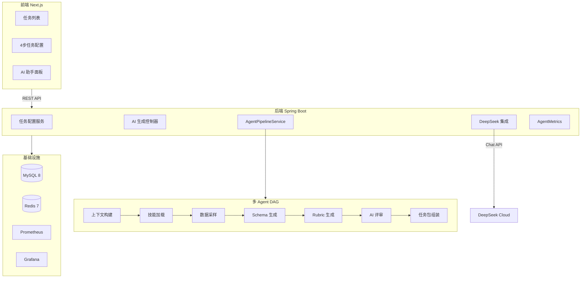

# LabelHub — AI 数据标注生产平台

LabelHub 是一个 AI 驱动的数据标注任务管理平台，支持从任务配置、标注执行到质量审核的全流程。基于多 Agent DAG 架构实现智能化任务配置和质量保障。

## 系统架构



## 多 Agent DAG 架构

LabelHub A 模块采用 7-stage 多 Agent 流水线，在任务发布前对配置进行全方位智能审核：

| Stage | Agent | 职责 | 输入 | 输出 |
|-------|-------|------|------|------|
| 1 | TaskContextBuilder | 组装任务上下文 | 任务名+说明+样例 | 结构化上下文 |
| 2 | SkillLoader | 加载专业技能 | 任务类型 | Prompt 上下文片段 |
| 3 | DatasetSampler | 样例数据采样/生成 | 上下文 | 验证后的样例集 |
| 4 | SchemaGenerator | 生成标注模板 | 样例+技能 | SchemaComponents |
| 5 | RubricGenerator | 生成质检规则 | Schema+样例 | RubricRules + Dimensions |
| 6 | Critic | 综合评审 | 全部产出 | 置信度+问题列表 |
| 7 | TaskPackageWriter | 组装任务包 | 全部 | 可发布的 TaskPackage |

每个 Agent 的执行结果通过 Micrometer 记录到 Prometheus，Grafana 面板可视化监控延迟、成功率和调用链。

## 项目结构

```
LabelHub/
├── apps/
│   ├── api/              # Java 21 + Spring Boot 3 后端
│   │   ├── controller/   # REST 接口层
│   │   ├── service/      # 业务逻辑层（DeepSeek、Pipeline、Metrics）
│   │   └── model/        # 数据模型
│   └── web/              # Next.js 14 前端
│       ├── components/   # React 组件（TaskStepper、TaskList、AiDrawer）
│       └── app/          # Next.js App Router
├── packages/
│   └── contracts/        # TypeScript 共享类型定义（TaskPackage、Schema、Rubric）
├── skills/               # Agent 技能定义（Markdown 格式，运行时加载）
├── deploy/               # Docker Compose + Nginx + Prometheus + Grafana
├── docs/                 # 架构文档、API 文档、开发过程记录
└── scripts/              # 部署脚本
```

## 模块分工（ABC 三角色）

| 模块 | 角色 | 职责 | 技术栈 |
|------|------|------|--------|
| **A（任务配置）** | 当前模块 | 任务创建、Schema 设计、Rubric 规则、AI 自动配置、多 Agent 审核 | Java + Next.js |
| **B（标注工作台）** | 协作方 | 标注员领取任务、执行标注、提交结果 | 消费 A 发布的 TaskPackage |
| **C（审核工作台）** | 协作方 | 审核员质检、打分、退回重标 | 消费 A 发布的 Rubric |

## 技术栈

- **后端**: Java 21, Spring Boot 3.3, MySQL 8, Redis 7, Flyway, Micrometer
- **前端**: Next.js 14, React 18, TypeScript, Tailwind CSS
- **AI**: DeepSeek Chat API（通过 Spring WebClient 调用）
- **多 Agent**: 7-stage DAG Pipeline（Java 编排，每个 Agent 独立 prompt + 技能注入）
- **监控**: Prometheus + Grafana（Agent 调用链、延迟、成功率）
- **部署**: Docker Compose, 阿里云 ECS, Nginx 反向代理

## 核心功能

### 1. 任务创建工作流（4 步 TaskStepper）

1. **上传数据** — 导入 JSON/JSONL 样例数据，AI 智能生成样例，支持手动添加/编辑/删除行
2. **配置模板** — AI 自动生成或手动编辑标注组件（10 种组件类型），支持 AI 一键智能生成
3. **质检规则** — AI 生成 Rubric 规则和评分维度，支持手动调整严重度和正反例
4. **确认发布** — 多 Agent DAG 智能审核（作为发布卡点），基础检查，确认后发布

### 2. AI 一键配置

Step 1 支持一键端到端生成：若无样例数据先自动生成，再生成完整配置（模板+规则+策略），直接跳转到发布页。

### 3. 每步 AI 辅助

- Step 1: AI 生成样例数据（单行智能生成 + N 行批量生成）
- Step 2: AI 智能生成标注模板
- Step 3: AI 智能生成质检规则
- Step 4: 多 Agent DAG 自动审核

### 4. 多 Agent 智能审核

发布前自动触发 7-stage 流水线，每个 Agent 产出详细自然语言报告：
- 任务信息完整性检查
- 标注技能匹配验证
- 样例数据质量评估
- 标注模板合理性评审
- 质检规则覆盖度分析
- 综合评审意见（含置信度）
- 发布就绪度确认

### 5. B/C 消费接口

| 接口 | 说明 | 消费方 |
|------|------|--------|
| `GET /api/tasks/{id}/package` | 获取完整任务包 | B + C |
| `GET /api/tasks/{id}/schema/current` | 获取当前 Schema | B |
| `GET /api/tasks/{id}/instructions` | 获取标注说明 | B |
| `GET /api/tasks/{id}/items/next` | 获取下一条待标注数据 | B |

### 6. 导出功能

支持 4 种导出格式：
- **JSON** — 完整 TaskPackage 结构，B/C 模块直接消费
- **JSONL** — 每行一个任务包，适合数据管线批量导入
- **CSV** — 扁平化摘要，Excel/Google Sheets 可打开
- **Markdown** — 人类可读报告，适合飞书/钉钉分享评审

## 快速开始

### 环境要求

- Java 21+
- Node.js 22+
- Docker & Docker Compose
- MySQL 8.x

### 本地开发

```bash
# 1. 安装前端依赖
npm install

# 2. 配置环境变量
cp .env.example .env
# 编辑 .env 填入 DEEPSEEK_API_KEY

# 3. 启动基础设施
cd deploy && docker compose up -d mysql redis

# 4. 启动后端
cd apps/api && ./mvnw spring-boot:run

# 5. 启动前端
npm run dev -w @labelhub/web
```

### Docker 部署（生产环境）

```bash
# 创建 .env 文件
echo "DEEPSEEK_API_KEY=your-key-here" > deploy/.env

# 一键启动所有服务
cd deploy && docker compose -p labelhub up -d --build
```

## API 文档

启动后端后访问 Swagger UI：`http://localhost:8080/swagger-ui.html`

### AI Agent 接口

| 接口 | 方法 | 说明 |
|------|------|------|
| `/agents/health` | GET | AI 服务健康检查 |
| `/agents/generate-task-config` | POST | AI 一键生成任务配置 |
| `/agents/generate-sample-data` | POST | AI 生成样例数据 |
| `/agents/pipeline` | POST | 执行多 Agent DAG 审核流水线 |
| `/agents/overview` | GET | Agent 运行状态总览 |
| `/agents/metrics-summary` | GET | 调用统计摘要 |

## 监控

- **Prometheus**: 采集 Spring Boot Actuator + 自定义 Agent 指标
- **Grafana**: 三个预置面板（Agent 总览、业务流水线、基础设施）
- **指标覆盖**: Agent 调用次数/延迟/成功率、Pipeline Stage 耗时、任务生命周期、级联失败

## 部署信息

- **ECS 地址**: `http://8.146.231.216`（阿里云 ECS，Nginx 反向代理）
- **服务端口**: Web 3000 / API 8080 / Grafana 3001 / Prometheus 9090
- **功能演示**: 4 步任务创建 → AI 一键配置 → 多 Agent 审核 → 发布任务包

## 环境变量

| 变量 | 说明 | 默认值 |
|------|------|--------|
| `DEEPSEEK_API_KEY` | DeepSeek API 密钥 | 无（必填） |
| `DEEPSEEK_BASE_URL` | DeepSeek API 地址 | `https://api.deepseek.com` |
| `SPRING_DATASOURCE_URL` | MySQL 连接地址 | `jdbc:mysql://mysql:3306/labelhub` |

## 文档目录

| 文档 | 路径 | 说明 |
|------|------|------|
| 架构设计 | `docs/architecture.md` | 系统架构、模块关系、数据流 |
| 多 Agent Pipeline | `docs/multi-agent-pipeline.md` | 7-stage DAG 设计、Agent 职责、Prompt 策略 |
| 开发过程 | `docs/development-process.md` | Sprint 迭代记录 |
| AI Coding 过程 | `docs/ai-coding-process.md` | Cursor Agent 辅助开发全流程记录 |
| 部署指南 | `docs/deployment-guide.md` | ECS 部署、Nginx 配置、故障排查 |
| API 文档 | `docs/api/member-a-api.md` | A 模块所有 REST 接口详细说明 |
| Schema 契约 | `docs/contracts/schema-contract.md` | A↔B 标注模板数据格式 |
| Rubric 契约 | `docs/contracts/rubric-contract.md` | A↔C 质检规则数据格式 |
| Prompt 契约 | `docs/contracts/prompt-template-contract.md` | AI 生成模板 |

## 开发规范

- 代码提交使用 Conventional Commits 格式
- 后端统一使用 Java，禁止引入 Python 运行时
- 前端使用 TypeScript 严格模式
- API 设计遵循 RESTful 规范
- 敏感信息（API Key 等）禁止提交到代码仓库，使用环境变量注入

## 交付物清单

- [x] 源码仓库（GitHub）
- [x] 中文 README（含架构图和 Agent 说明）
- [x] 多 Agent Pipeline 设计文档
- [x] 架构图 / 技术文档
- [x] AI Coding 过程记录
- [x] 可访问演示环境
- [x] API 文档（Swagger + Markdown）
- [x] 监控面板（Prometheus + Grafana）
- [ ] 5-10 分钟演示视频（待录制）
