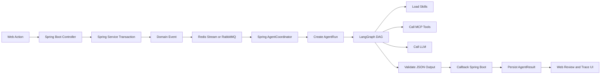
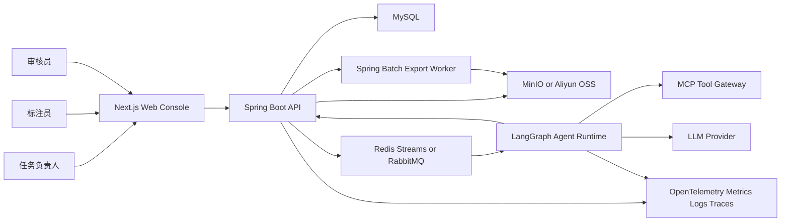
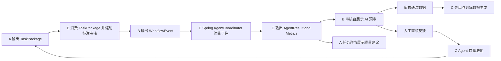
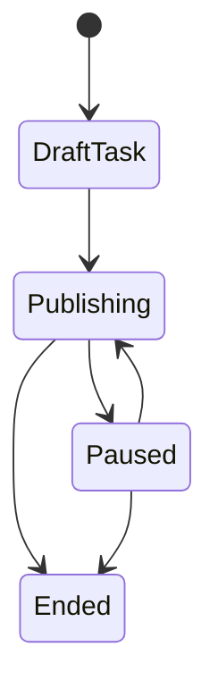
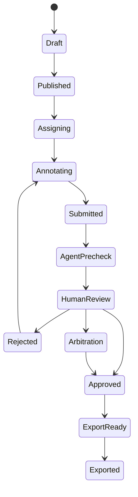
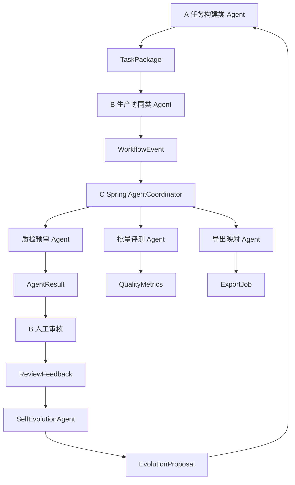
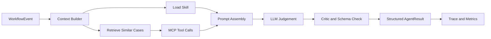
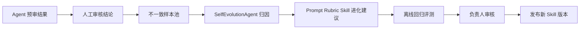

# LabelHub 三人全栈分工与系统设计方案

## 1. 项目定位与目标

LabelHub 是一个面向真实 AI 数据生产流程的数据标注平台，核心目标不是只做一个表单系统，而是覆盖“任务配置 -> 数据导入 -> 标注生产 -> AI 自动预审 -> 人工审核流转 -> 质量分析 -> 多格式导出 -> Agent 自我进化”的完整链路。

项目需要体现三类能力：

- 复杂动态表单架构：负责人可拖拽搭建文本分类、实体抽取、图片框选、打分、单选、多选、富文本说明等标注组件，并生成可版本化的任务 Schema。
- 长链路工作流状态流转：支持标注员领取/提交、AI 预审、初审、复审、退回、仲裁、发布、导出等状态。
- AI 质检 Agent 落地：基于任务说明、评测标准、历史样例、工具调用与审核反馈，对标注结果做自动预审、批量评测、解释生成和质量改进。

本项目的团队组织目标也很明确：三个人不能只按“前端、后端、算法”横向切开，而是每个人都完成一个可演示、可测试、可独立运行的全栈闭环。每个闭环都必须包含页面、API、数据表、事件、Agent、测试和观测埋点，同时通过统一的 TaskPackage、WorkflowEvent、AgentRun 和 ExportJob 等契约串成完整平台。

## 1.0 飞书课题硬性要求对齐

本方案按飞书文档《LabelHub 数据标注平台 · AI全栈课题实现要求》补齐以下硬性验收点，三人开发时不得遗漏：

- 最终交付物必须覆盖三端：任务负责人后台、标注员工作台、AI 审核 Agent，并支持人工审核员工作台。
- 最少角色必须实现 `Owner`、`Labeler`、`Reviewer`；AI Agent 可由后端服务承载，但必须具备独立系统账户视角和可追溯审核记录。
- Owner 必须能完成“建任务 -> 搭模板 -> 发布 -> 看结果 -> 导出”全流程。
- Labeler 必须能完成“任务广场 -> 领任务 -> 作答 -> 草稿自动保存 -> 提交 -> 看打回 -> 修改”全流程。
- 动态表单必须实现 Designer + Renderer 解耦，搭建产物为可序列化 JSON Schema，同一份 Schema 既能预览也能在标注台运行时渲染。
- 动态表单至少支持：单行输入、多行文本、单选、多选、标签选择、富文本编辑器、文件/图片上传、JSON 编辑器、LLM 交互组件、展示项 ShowItem。
- 动态表单进阶要求：字段联动、联动校验、自定义校验规则、分组容器、多 Tab 布局。
- AI 自动预审必须支持任务负责人配置审核 Prompt 模板和评分维度，例如相关性、准确性、格式合规、安全性。
- AI 预审必须异步入队，使用 Function Calling 或结构化输出，支持失败重试、幂等性和人工兜底。
- 人工审核状态必须可追溯，支持批量操作；打回必须附理由，标注员能看到上一轮审核意见。
- 导出至少支持 JSON、JSONL、CSV、Excel 四种格式，必须支持异步导出、下载历史、字段映射和是否包含审核记录。
- 验收权重按功能完备性 60%、工程质量 25%、产品体验 15% 组织交付。
- 提交物建议包含源码仓库、README、5 到 10 分钟演示视频、架构图/关键技术文档/Demo 截图、AI Coding 过程记录、可访问演示环境说明和 API 文档。

## 1.1 三人协作的核心原则

三人分工采用“纵向业务闭环 + 横向架构责任”的方式：

- 纵向业务闭环：A 负责任务如何被创建出来，B 负责任务如何被生产和审核，C 负责 AI 如何质检、批量执行、导出和进化。
- 横向架构责任：每个人都负责一段公共架构，不只是自己的页面。A 定义 Schema/TaskPackage 契约，B 定义工作流状态机和事件契约，C 定义 Agent 总线、任务队列、观测和部署契约。
- 串联方式：A 输出可执行任务包，B 消费任务包并产出标注/审核事件，C 消费事件触发 Agent 与导出，再把预审、指标和进化建议回写给 A/B 的页面。
- 开发方式：每个人先用 Mock 数据独立跑通自己的闭环，再通过共享契约集成，不互相等待。
- 验收方式：每个人的模块必须能单独演示，同时最终可以串成一条从任务创建到数据导出的端到端链路。

## 2. 推荐技术栈

为方便三人并行开发、Docker 化和 AI 辅助生成代码，建议采用以下默认栈：

- 前端：Next.js + React 18 + TypeScript + Tailwind CSS + Zustand 或 TanStack Query。
- 组件与交互：Semi Design / Ant Design 作为业务组件基座，自建 LabelHub Design Tokens 保持统一视觉。
- 拖拽搭建：dnd-kit。
- 表单渲染：Formily + JSON Schema Renderer，复杂校验可结合 Zod 或自定义校验器。
- 业务后端：Java 21 + Spring Boot 3，负责 RBAC、任务、工作流、审核、导出、事件、队列、审计和 Agent 调用编排。
- Spring 组件：Spring Web、Spring Security、Spring Data JPA 或 MyBatis-Plus、Bean Validation、Flyway、springdoc-openapi、Actuator、Micrometer。
- Agent Runtime：LangGraph，建议使用 Python LangGraph 独立服务承载 Agent DAG、IAG/RAG、Skill 调用、MCP 工具调用和批量评测；由 Spring Boot 通过 REST/SSE/Redis Stream 调用。
- 数据库：MySQL 8，保存任务、Schema、标注结果、审核记录、Agent 运行记录；如团队已有 PostgreSQL 经验也可替换，但答辩文档按 MySQL 说明。
- 队列与定时任务：Redis Streams 或 RabbitMQ + Spring Scheduler/Quartz/Spring Batch，处理 AI 预审、批量跑、导出、超时提醒、夜间质检。
- 文件存储：开发用 MinIO，部署到阿里云可切换 OSS。
- 可观测性：OpenTelemetry + Prometheus + Grafana + Loki，至少保留请求日志、Agent Trace、工具调用日志和端到端耗时。
- 部署：Docker Compose 本地一键启动；阿里云 ECS + ACR 镜像仓库 + OSS + RDS MySQL 可作为增强部署形态。

### Java Spring Boot 与 LangGraph 边界

本项目后端必须以 Java Spring Boot 作为业务事实中心，LangGraph 只作为 Agent 编排运行时。两者边界必须清晰：

- Spring Boot 负责：用户权限、任务配置、Schema 版本、数据导入、状态机、标注提交、审核流转、事件发布、队列消费、导出任务、审计日志、指标聚合、数据库事务。
- LangGraph 负责：Agent DAG、IAG/RAG 上下文组装、Skill 加载、MCP 工具调用、LLM 调用、Critic 校验、结构化 AgentResult 生成、自我进化建议生成。
- LangGraph 不允许直接修改核心业务状态，只能把结果写回 Spring Boot 提供的 AgentRun/AgentResult API。
- Spring Boot 调用 LangGraph 必须异步优先：提交标注后写入事件和队列，不等待 LLM 返回。
- 所有跨服务调用必须携带 `traceId`、`taskId`、`itemId`、`agentRunId`。
- 如果比赛要求所有服务都用 Java，可把 LangGraph Runtime 替换为 LangGraph4j，但默认方案仍推荐 Python LangGraph 独立服务，因为生态更成熟。

Spring Boot 与 LangGraph 调用链：




工程目录建议：

```text
labelhub/
  apps/
    web/                         # Next.js 前端
    api/                         # Java Spring Boot 业务后端
    agent-runtime/               # LangGraph Agent Runtime
  packages/
    contracts/                   # OpenAPI、JSON Schema、Mock 契约
    design-tokens/               # 前端统一 tokens
  deploy/
    docker-compose.yml
    nginx/
    aliyun/
  docs/
    architecture/
    api/
    agent/
```

## 3. 统一前端设计风格

采用 enterprise design skill 作为主风格，融合 agentic design skill 的“对话式 AI 委托”体验。

设计意图：LabelHub 应该像一个高可信的数据生产控制台，信息密度高但不混乱；AI 能力以清晰的辅助面板、建议和自动化任务呈现，而不是喧宾夺主。

### 设计 Tokens

- 主色：`#072C2C`，用于导航、主按钮、关键标题和高优先级边框。
- 强调色：`#FF5F03`，用于 AI 建议、待处理提醒、关键 CTA 和 Agent 状态。
- 成功色：`#16A34A`，用于通过、完成、发布状态。
- 警告色：`#D97706`，用于低置信度、超时、需复核状态。
- 危险色：`#DC2626`，用于驳回、违规、失败状态。
- 背景色：`#EDEADE`，作为控制台底色。
- 正文色：`#111827`。
- 字体：标题使用 Oswald，正文使用 Ubuntu，代码、Schema、Trace ID 使用 Ubuntu Mono 或 JetBrains Mono。
- 间距：8pt 基线网格，卡片内边距默认 16/24px，主内容最大宽度按控制台自适应，不做过窄居中布局。

### 页面结构规则

- 所有页面采用统一三段式：左侧导航、顶部任务上下文栏、右侧主工作区。
- AI 相关能力固定使用右侧 Agent Panel 或页面内 Inline Suggestion，不允许每个人各自做不同样式的聊天框。
- 数据生产页面优先使用卡片、分栏、状态标签、进度条和审计日志，不使用营销页式大面积渐变。
- 标注页面必须支持键盘优先操作，常用动作包括提交、跳过、保存草稿、下一条、上一条、退回。
- 所有组件必须实现默认、hover、focus-visible、active、disabled、loading、error 状态。
- 空状态、加载态、失败态必须统一：空状态说明下一步动作，失败态提供重试和错误编号。

### 核心组件清单

- `AppShell`：左侧导航、顶部状态栏、当前角色切换入口。
- `TaskCard`：任务状态、进度、低质率、待审数量、Agent 预审覆盖率。
- `SchemaBuilder`：拖拽组件面板、画布、属性配置、Schema JSON 预览。
- `AnnotationRenderer`：根据 Schema 动态渲染标注页面。
- `ReviewWorkbench`：原始数据、标注结果、AI 预审意见、人工审核动作四栏布局。
- `AgentPanel`：展示 Agent 目标、工具调用、置信度、建议、引用依据、耗时。
- `TraceDrawer`：展示一次任务从前端提交到 Agent 工具调用再到审核结果的完整链路。
- `MetricDashboard`：任务吞吐、通过率、退回率、端到端时延、Agent 准确率。

## 3.1 前端页面必须长什么样

为了避免三个人分别写出三套风格，前端一开始就固定为“企业级数据生产控制台 + 右侧 Agent 辅助面板”的统一形态。所有页面都遵守同一套 AppShell，不允许每个人自己发明导航、按钮、卡片、聊天框和状态色。

### 全局 AppShell

所有页面统一使用以下结构：

```text
┌────────────────────────────────────────────────────────────────────────────┐
│ TopBar: LabelHub / 当前任务 / 角色切换 / 全局搜索 / 通知 / 用户             │
├───────────────┬──────────────────────────────────────────────┬─────────────┤
│ LeftNav       │ Main Workspace                               │ AgentPanel  │
│               │                                              │             │
│ Dashboard     │ 页面标题 + 描述 + 主操作按钮                 │ 当前 Agent  │
│ Tasks         │ 关键指标卡片 / 表格 / 表单 / 工作台          │ 建议        │
│ Datasets      │                                              │ 工具调用    │
│ Marketplace   │                                              │ Prompt版本  │
│ Annotation    │                                              │ 置信度      │
│ Review        │                                              │ Trace       │
│ Agents        │                                              │             │
│ Export        │                                              │             │
│ Observability │                                              │             │
└───────────────┴──────────────────────────────────────────────┴─────────────┘
```

布局规则：

- 左侧导航宽度固定 240px，背景使用 `primary #072C2C`，文字使用浅色，高亮项使用 `accent #FF5F03`。
- 顶部栏高度 56px，显示当前任务上下文、角色、全局搜索和通知。
- 主工作区背景使用 `surface #EDEADE`，内部卡片使用接近白色的浅色表面。
- 右侧 AgentPanel 默认宽度 360px，可折叠；所有 AI 建议、工具调用、Trace 摘要都放这里。
- 页面主按钮使用 primary，AI 相关 CTA 使用 accent，危险动作使用 danger。
- 数据密集页面优先用表格、过滤器、状态标签、指标卡，不做大面积插画。

### 页面一：任务负责人 Dashboard

用途：任务负责人一进入平台看到全局生产状态。

```text
┌─ 页面标题：数据生产总览 ───────────────────────────────────────┐
│ [新建任务] [导入数据] [任务发布抽屉] [查看批处理]                │
├───────────────────────────────────────────────────────────────┤
│ MetricCard: 进行中任务 | 待审核数据 | Agent 预审覆盖率 | 退回率 │
├───────────────────────────────────────────────────────────────┤
│ TaskCard Grid                                                  │
│ ┌任务A────────────┐ ┌任务B────────────┐ ┌任务C────────────┐     │
│ │进度 67%          │ │待审 230         │ │低置信 18        │     │
│ │通过率 91%        │ │Agent 一致率 83% │ │P95 12.4s        │     │
│ └─────────────────┘ └─────────────────┘ └─────────────────┘     │
├───────────────────────────────────────────────────────────────┤
│ 最近告警：低质量批次 / 队列积压 / Agent 失败 / 导出完成         │
└───────────────────────────────────────────────────────────────┘
```

页面规范：

- A 负责实现任务卡片和任务质量入口。
- C 负责把 Agent 覆盖率、一致率、P95 时延、队列积压指标接入。
- B 负责提供待审核、退回率、生产进度数据。
- 任务状态必须覆盖飞书要求的 `草稿`、`发布中`、`已暂停`、`已结束`。
- 任务基础信息必须包括标题、描述、富文本说明、标签、奖励规则、截止时间、配额。
- 任务发布抽屉必须展示分发策略、配额、截止时间、发布前检查和风险提示。

### 页面二：任务创建与发布向导

用途：负责人从 0 创建可执行任务。

```text
┌─ 创建任务 ─────────────────────────────────────────────────────┐
│ Stepper: 基础信息 > 任务说明 > 模板搭建 > 数据导入 > 质检规则 > 发布 │
├───────────────────────────────┬───────────────────────────────┤
│ Main Form                     │ AgentPanel                    │
│ 任务名称                      │ SchemaAssistAgent             │
│ 任务目标                      │ - 根据说明生成 Schema 草案     │
│ 奖励规则/截止时间/配额         │ - 生成 Prompt 模板和评分维度   │
│ 数据类型                      │ - 发现说明含糊点              │
│ 分配策略                      │ - 生成 Rubric 建议            │
│ 下一步按钮                    │ - 展示工具调用和引用样例       │
└───────────────────────────────┴───────────────────────────────┘
```

页面规范：

- A 主责，必须使用步骤条和右侧 AgentPanel。
- 任务发布前必须展示发布检查清单：基础信息、富文本说明、Schema、数据、Rubric、Prompt 模板、评分维度、AgentPolicy、分配策略、配额、截止时间。
- 所有 Agent 建议都必须有“采纳”“忽略”“查看依据”三个动作。
- 任务分发策略第一版至少实现一种：先到先得、指派、配额抢单；建议 A/B 协作实现先到先得 + 配额限制。

### 页面三：SchemaBuilder 动态表单搭建器

用途：负责人拖拽生成标注页面。

```text
┌─ SchemaBuilder ────────────────────────────────────────────────┐
│ [保存草稿] [预览标注页] [生成新版本] [发布]                    │
├──────────────┬──────────────────────────────┬─────────────────┤
│ ComponentLib │ Canvas                       │ PropertyPanel   │
│ 单行/多行文本  │ ┌ShowItem：题目文本──────┐  │ label           │
│ 单选/多选/标签 │ │ {{raw.question}}        │  │ required        │
│ 富文本编辑器   │ └────────────────────────┘  │ validation      │
│ 文件/图片上传  │ ┌LLM 交互组件───────────┐  │ options         │
│ JSON 编辑器    │ │ 生成参考答案/预填字段   │  │ visibleWhen     │
│ ShowItem       │ └────────────────────────┘  │ dataPath        │
│ LLM 交互组件   │                              │ tabs/group      │
├──────────────┴──────────────────────────────┴─────────────────┤
│ Bottom Drawer: Schema JSON / 校验结果 / 版本差异               │
└───────────────────────────────────────────────────────────────┘
```

页面规范：

- A 主责，B 必须复用同一份 Schema 渲染 AnnotationRenderer。Designer 与 Renderer 必须解耦，搭建产物必须是可序列化 JSON Schema。
- 属性面板必须使用统一表单控件，不允许写散乱 JSON 编辑器作为唯一入口。
- Schema JSON 只能作为高级视图，不作为普通用户主操作方式。
- 物料至少支持飞书要求的 10 类：单行输入、多行文本、单选、多选、标签选择、富文本编辑器、文件/图片上传、JSON 编辑器、LLM 交互组件、展示项 ShowItem。
- 进阶能力必须规划字段联动、条件显示、联动校验、自定义校验规则、分组容器和多 Tab 布局。
- LLM 交互组件属于模板物料，输出可作为标注参考或预填字段，但需要记录调用结果和是否被标注员采纳。

### 页面四：标注员工作台

用途：标注员高效完成数据标注。

```text
┌─ 标注员工作台 ─────────────────────────────────────────────────┐
│ Tabs: 任务广场 / 标注工作台 / 我的数据                          │
│ FilterBar: 搜索 / 标签 / 奖励 / 截止时间 / 状态                  │
├───────────────────────────────────────────────────────────────┤
│ TaskCard Grid: 可领取 / 进行中 / 已提交 / 已打回 / 待修改        │
├───────────────────────────────┬───────────────────────────────┤
│ Data Preview                  │ Dynamic Annotation Form        │
│ 原始文本/图片/上下文           │ 根据 A 的 Schema 渲染            │
│ 任务说明/打回提示              │ 保存草稿 / 提交 / 跳题 / 上一题/下一题 │
└───────────────────────────────┴───────────────────────────────┘
```

页面规范：

- B 主责。
- 标注页默认不展示复杂 Agent 聊天，避免干扰生产；只展示必要任务说明、退回意见和快捷键。
- 被退回数据必须展示字段级差异和审核员建议。
- 必须实现任务广场的搜索、筛选、任务卡片和领取入口。
- 必须实现草稿自动保存，保存失败要有明确提示，避免数据丢失。
- 提交前必须执行 Schema 校验并展示字段级错误。
- 必须支持题目级 LLM 辅助调用，调用来源是 A 的 LLM 交互组件配置。
- “我的数据”必须展示已提交、通过、打回、待修改的统计与列表。

### 页面五：审核工作台

用途：审核员结合 AI 预审做人工判断。

```text
┌─ ReviewWorkbench ──────────────────────────────────────────────┐
│ FilterBar: 待审 / 高风险 / 低置信 / 已通过 / 已退回             │
├───────────────┬────────────────┬────────────────┬─────────────┤
│ 原始数据       │ 标注结果        │ AI 预审结果      │ 审核动作     │
│ rawPayload    │ annotation      │ decision        │ 通过         │
│ metadata      │ field diff      │ confidence      │ 退回         │
│ task rubric   │ history         │ riskTags        │ 修改后通过   │
│               │ round1/round2 diff │ evidence     │ 批量操作     │
└───────────────┴────────────────┴────────────────┴─────────────┘
│ TraceDrawer: 展开查看 Agent 输入、Skill、MCP 工具调用、耗时      │
└───────────────────────────────────────────────────────────────┘
```

页面规范：

- B 主责审核工作台，C 主责 AI 预审结果和 Trace 数据。
- AI 结论不能替代人工最终结论，按钮文案必须体现“参考 AI 建议”。
- 低置信、高风险、工具失败必须用 warning/danger 状态标签标出。
- 必须支持初审、复审、终审视图中的至少两级审核配置，第一版可实现“AI 预审 + 人工复审”。
- 必须展示第 1/2 轮差异、AI 评语、人工打回原因和完整审计时间线。
- 审核员必须能批量通过或批量打回；打回必须填写理由。

### 页面六：Agent 运行与可观测性

用途：展示 Agent、IAG/RAG、Skill、MCP、工具调用和端到端时延。

```text
┌─ Agent Observability ──────────────────────────────────────────┐
│ MetricCard: Agent 成功率 | P95 时延 | 工具失败率 | 队列积压     │
├───────────────────────────────────────────────────────────────┤
│ Trace Timeline                                                 │
│ Web Submit -> API -> Queue -> Agent -> Skill -> MCP Tool -> DB │
├───────────────────────┬───────────────────────────────────────┤
│ AgentRun List         │ Trace Detail                          │
│ runId                 │ 输入摘要 / Prompt 版本 / Skill 版本    │
│ status                │ IAG 检索命中 / MCP 调用 / 输出 JSON    │
│ latency               │ 错误堆栈 / 重试 / token 使用量          │
└───────────────────────┴───────────────────────────────────────┘
```

页面规范：

- C 主责。
- A/B 必须在自己的关键操作中传 `traceId`，否则 C 的观测链路不完整。
- 页面必须支持按 taskId、itemId、agentName、skillVersion、status、traceId 过滤。

### 页面七：自我进化中心

用途：展示 Agent 如何从人工反馈中形成可审批的进化建议。

```text
┌─ Agent 自我进化中心 ───────────────────────────────────────────┐
│ Tabs: 不一致样本池 / 错误归因 / 进化建议 / 离线评测 / 发布记录 │
├───────────────────────────────────────────────────────────────┤
│ 左侧：失败样本列表                                             │
│ 中间：AI 结论 vs 人工结论 vs 差异原因                          │
│ 右侧：SelfEvolutionAgent 建议                                  │
│       Prompt 修改 / Rubric 增补 / Skill 升级 / 阈值调整         │
├───────────────────────────────────────────────────────────────┤
│ EvalCard: 一致率 Before/After | 误拒率 | 漏检率 | 建议是否发布  │
└───────────────────────────────────────────────────────────────┘
```

页面规范：

- C 主责进化建议和离线评测。
- A 主责负责人审批入口，因为进化结果会影响任务说明、Rubric 和 Skill 版本。
- B 主责提供人工审核反馈和字段级差异。

### 页面八：导出中心

用途：负责人导出可用于训练的大模型数据。

```text
┌─ Export Center ────────────────────────────────────────────────┐
│ 选择任务 / 数据状态 / Schema 版本 / 审核时间 / 导出格式         │
├───────────────────────────────┬───────────────────────────────┤
│ Export Config                 │ Preview                       │
│ JSON / JSONL / CSV / Excel    │ 字段映射预览                   │
│ Parquet / COCO / YOLO 可选     │ 前 5 条样例                    │
│ 质量门禁                      │ 缺失字段检查                   │
├───────────────────────────────┴───────────────────────────────┤
│ ExportJob History: queued/running/completed/failed/download    │
└───────────────────────────────────────────────────────────────┘
```

页面规范：

- C 主责。
- 只能导出通过审核或满足任务配置的数据。
- 导出前必须展示质量检查结果和字段映射预览。
- 飞书验收要求至少支持 JSON、JSONL、CSV、Excel 四种格式；Parquet、COCO、YOLO、OpenAI messages、DPO pair 作为加分项。
- 必须支持异步导出、下载历史、进度查询、字段重命名、是否包含审核记录。

## 4. 总体架构




## 4.0 Java Spring Boot 后端模块结构

Spring Boot 后端建议采用模块化单体优先，后续可拆微服务。这样三个人都能在同一个 Java 后端工程里开发自己的业务模块，同时保持清晰边界。

推荐模块：

- `labelhub-auth`：登录、JWT、RBAC、角色权限、用户管理。
- `labelhub-task`：任务、Instruction、Schema、Rubric、Dataset、TaskPackage。
- `labelhub-workflow`：Assignment、Annotation、Review、状态机、WorkflowEvent、AuditLog。
- `labelhub-agent`：AgentPolicy、AgentRun、ToolCall、AgentResult、LangGraph 调用客户端。
- `labelhub-batch`：批量预审、定时抽检、质量聚合、导出任务、失败重试。
- `labelhub-export`：JSONL、CSV、Parquet、COCO、YOLO、OpenAI messages、DPO pair。
- `labelhub-observability`：traceId、Actuator、Micrometer、OpenTelemetry、审计查询。
- `labelhub-common`：统一异常、DTO、枚举、分页、时间、JSON Schema 校验工具。

Spring Boot 基础规范：

- Controller 只做参数校验和权限入口，业务逻辑放 Service。
- 所有写操作必须通过事务边界，使用 `@Transactional`。
- DTO 使用 Bean Validation，例如 `@NotNull`、`@NotBlank`、`@Valid`。
- API 文档使用 springdoc-openapi 自动生成。
- 数据库迁移使用 Flyway，所有表结构变化必须写 migration。
- 状态机可以用 Spring Statemachine，也可以用显式枚举 + Transition Service；不允许在前端写状态跳转。
- 异步任务优先用 Redis Streams/RabbitMQ 承接，定时任务用 Quartz 或 Spring Scheduler。

## 4.1 三个闭环如何串起来




串联后的完整链路：

1. A 创建任务、导入数据、配置 Rubric 和 Schema，发布后生成 `TaskPackage`。
2. B 根据 `TaskPackage` 渲染标注页面、分配 DataItem、接收标注提交，并在关键动作产生 `WorkflowEvent`。
3. C 监听 `annotation.submitted`、`review.completed`、`task.published` 等事件，异步触发预审、批量评测、指标聚合和导出任务。
4. C 把 `AgentResult` 写回后，B 在审核台展示 AI 证据，A 在任务详情看到数据质量和 Schema/Rubric 改进建议。
5. B 的人工审核反馈进入 C 的 EvolutionDataset，C 生成下一版 Prompt/Rubric/Skill 建议，再回到 A 的任务配置页由负责人确认是否升级。

## 4.2 架构责任分工

除了各自业务功能，三个人还需要分别承担公共架构的一部分，避免最后没人负责“怎么串起来”。

### 成员 A 的架构责任：任务契约、Schema 标准与任务构建 Agent

A 是“任务定义中心”的 owner，负责让后续所有模块知道一个任务到底长什么样。A 不是只做表单和导入，也必须完成一组“任务构建类 Agent”，让负责人能用自然语言、样例数据和业务规则半自动生成任务配置。

- 定义 `TaskPackage` 标准：任务说明、Schema 当前版本、Rubric、样例、数据字段映射、分配策略、Agent 配置。
- 定义动态表单 Schema 规范：组件类型、组件属性、校验规则、数据绑定路径、默认值、展示条件、版本号。
- 定义 Rubric 规则结构：规则 ID、规则描述、严重程度、适用字段、判定示例、是否允许 Agent 自动通过。
- 定义导入数据标准：每条 DataItem 的 `rawPayload`、`displayPayload`、`mediaRefs`、`metadata`。
- 提供 Mock TaskPackage，保证 B/C 不等 A 完成真实页面也能先开发。
- 维护前端设计 tokens 和基础组件使用规范，确保三个人写的页面风格一致。
- 负责 `SchemaAssistAgent`：根据任务说明和样例数据生成动态表单 Schema 草案。
- 负责 `InstructionRefineAgent`：检查任务说明是否含糊，生成更适合标注员执行的说明。
- 负责 `RubricDraftAgent`：根据任务目标生成结构化评测规则，供 C 的质检 Agent 使用。
- 负责 `DatasetProfileAgent`：对导入数据做抽样画像，发现空字段、重复、异常长度、格式不一致。
- 负责 A 侧 LangGraph DAG：`task_context_builder -> skill_loader -> dataset_sampler -> schema_generator -> rubric_generator -> critic -> task_package_writer`。
- 负责 A 侧 Skill：`task-schema-builder`、`instruction-refine`、`dataset-profile`、`design-enterprise`。
- 负责 A 侧 MCP 工具：`task.getPackage`、`schema.getVersion`、`rubric.getVersion`、`dataset.sample`、`dataset.profile`。
- A 的 Agent 输出必须落到 `TaskPackage`、`SchemaRiskReport`、`DatasetProfileReport` 或 `RubricDraft`，不能直接参与审核结论。

### 成员 B 的架构责任：状态机、权限、业务事件与生产协同 Agent

B 是“生产流转中心”的 owner，负责让任务包变成真实标注与审核生产流程。B 也必须做 Agent，但 B 的 Agent 不是最终质检裁判，而是服务于“分配更合理、审核更高效、冲突更容易解释”。

- 定义工作流状态机：任务状态、DataItem 状态、Assignment 状态、Annotation 状态、Review 状态。
- 定义 `WorkflowEvent` 标准：任务发布、数据领取、草稿保存、标注提交、AI 预审完成、审核通过、审核退回、仲裁完成。
- 定义权限矩阵：负责人、标注员、初审员、复审员、管理员分别能看什么、改什么、触发什么动作。
- 定义审核动作标准：通过、退回、修改后通过、升级复审、进入仲裁、批量通过、批量退回。
- 提供 Mock WorkflowEvent，保证 C 可以先开发 Agent 监听和批处理。
- 保证所有状态变更都有 AuditLog，C 的可观测性和自我进化可以追溯。
- 负责 `AssignmentAgent`：根据人员负载、历史质量、任务难度和截止时间，建议分配策略。
- 负责 `ReviewAssistAgent`：在审核台总结标注风险点、字段级差异和可能的退回原因。
- 负责 `ConflictResolveAgent`：多人标注或审核意见冲突时，生成冲突解释和仲裁辅助意见。
- 负责 `SLAAgent`：发现超时、积压、低效队列，给出调度和提醒建议。
- 负责 B 侧 LangGraph DAG：`workflow_context_builder -> skill_loader -> similar_annotation_retriever -> review_summarizer -> conflict_analyzer -> action_advisor`。
- 负责 B 侧 Skill：`assignment-policy`、`review-assist`、`reviewer-coach`、`sla-monitor`。
- 负责 B 侧 MCP 工具：`annotation.getSubmitted`、`annotation.lookupSimilar`、`review.getHistory`、`workflow.getAuditTrail`、`assignment.getLoad`。
- B 的 Agent 输出必须进入 `ReviewSuggestion`、`AssignmentSuggestion`、`ConflictExplanation` 或 `SLAAlert`，不能直接替代人工审核动作。

### 成员 C 的架构责任：Agent 总线、质检 Agent、异步任务和部署观测

C 是“智能执行与平台运行中心”的 owner，负责把 A/B 产生的数据变成 AI 质检、批处理、导出和进化能力。

- 定义 `AgentRun` 标准：agentName、agentVersion、skillVersion、inputRef、output、confidence、status、latencyMs、traceId。
- 定义 `ToolCall` 标准：toolName、argumentsSummary、resultSummary、latencyMs、retryCount、errorCode。
- 定义 Spring AgentCoordinator 与 LangGraph DAG 边界：Spring 根据事件类型、任务配置、队列负载创建 AgentRun，LangGraph 执行具体 Agent DAG。
- 定义异步任务标准：Job 类型、状态、进度、失败重试、取消、超时、死信队列。
- 定义观测标准：traceId 贯穿 web、api、queue、agent、tool、db、export。
- 定义 Docker Compose 和阿里云部署标准，保证三个人模块最后能一起启动。
- 负责 `PreReviewAgent`：根据 A 的 Rubric/Schema 和 B 的标注结果做 AI 自动预审。
- 负责 `RubricJudgeAgent`：逐条规则判定 pass/fail/uncertain，并给出证据和建议。
- 负责 `BatchEvalAgent`：批量统计 Agent 与人工审核一致率，发现系统性误判。
- 负责 `ExportFormatAgent`：把审核通过数据映射成 JSONL、CSV、Parquet、COCO、YOLO、OpenAI messages、DPO pair 等格式。
- 负责 `SelfEvolutionAgent`：基于 B 的人工审核反馈生成 Prompt/Rubric/Skill/阈值进化建议。
- 负责 C 侧 LangGraph DAG：`event_router -> context_builder -> skill_loader -> retriever -> mcp_tools -> llm_judge -> critic -> schema_validator -> result_callback`。
- 负责 C 侧 Skill：`rubric-judge`、`tool-calling-policy`、`export-format`、`self-evolution`、`trace-explain`。
- 负责 C 侧 MCP 工具：`metrics.aggregate`、`trace.write`、`file.export`、`agent.getRun`、`evolution.createProposal`。
- C 的 Agent 输出必须进入 `AgentResult`、`QualityMetrics`、`ExportJob`、`EvolutionProposal` 或 `AgentTrace`，不能绕过 B 的状态机直接改变标注/审核状态。

### 4.2.1 三个人的 Agent 工作对比


| 成员  | Agent 类型    | 主要目标            | 典型输入                           | 典型输出                                       | 是否能改业务状态             |
| --- | ----------- | --------------- | ------------------------------ | ------------------------------------------ | -------------------- |
| A   | 任务构建类 Agent | 把业务说明变成可执行任务包   | 任务说明、样例数据、字段结构                 | Schema、Rubric、TaskPackage、数据画像             | 不能，只能生成配置建议          |
| B   | 生产协同类 Agent | 提高标注和审核效率       | 标注结果、审核历史、人员负载                 | 分配建议、审核建议、冲突解释、SLA 告警                      | 不能，只能辅助人工动作          |
| C   | 质检执行类 Agent | 自动预审、批量评测、导出和进化 | TaskPackage、WorkflowEvent、人工反馈 | AgentResult、ExportJob、EvolutionProposal、指标 | 不能，最终状态仍走 B 的工作流 API |


这意味着三个人都必须接触 Agent、Skill、MCP 和可观测性，只是 Agent 的业务定位不同：A 让任务“建得好”，B 让生产“流得顺”，C 让质检“判得准并能进化”。

## 4.3 四个统一契约

三个闭环能否串起来，关键看下面四个契约必须先定下来。

### `TaskPackage`

由 A 产出，B/C 消费。

```json
{
  "taskId": "task_001",
  "schemaVersionId": "schema_v3",
  "instructionVersionId": "ins_v2",
  "rubricVersionId": "rubric_v2",
  "datasetId": "dataset_001",
  "assignmentPolicy": {
    "mode": "auto_claim",
    "replicasPerItem": 1,
    "deadlineHours": 24
  },
  "agentPolicy": {
    "precheckEnabled": true,
    "confidenceThreshold": 0.82,
    "toolWhitelist": ["dataset.query", "annotation.lookupSimilar", "rubric.get"]
  }
}
```

### `WorkflowEvent`

由 B 产出，C 消费，A/B/C 都能在审计日志中查看。

```json
{
  "eventId": "evt_001",
  "eventType": "annotation.submitted",
  "taskId": "task_001",
  "itemId": "item_001",
  "actorId": "user_annotator_01",
  "payloadRef": "annotation_001",
  "traceId": "trace_abc",
  "createdAt": "2026-05-20T09:00:00Z"
}
```

### `AgentResult`

由 C 产出，B 展示，A 用于任务改进。

```json
{
  "agentRunId": "run_001",
  "taskId": "task_001",
  "itemId": "item_001",
  "decision": "needs_review",
  "confidence": 0.76,
  "riskTags": ["missing_required_field"],
  "summary": "缺少必填字段，需要人工复核。",
  "traceId": "trace_abc"
}
```

### `EvolutionProposal`

由 C 产出，A 负责确认是否升级任务说明、Rubric 或 Skill，B 负责提供人工反馈样本。

```json
{
  "proposalId": "evo_001",
  "source": "review_feedback_batch",
  "target": "rubric",
  "currentVersionId": "rubric_v2",
  "suggestedChange": "增加实体边界不完整时的判定规则。",
  "evidenceCount": 18,
  "offlineEvalSummary": {
    "consistencyBefore": 0.71,
    "consistencyAfter": 0.84
  },
  "status": "pending_owner_approval"
}
```

## 4.4 集成分工矩阵

- A -> B：提供当前任务 Schema、字段映射、任务说明、Rubric、样例数据，B 才能渲染标注页和审核页。
- A -> C：提供 Agent Policy、Rubric、Schema、样例和数据抽样接口，C 才能做预审和数据画像。
- B -> A：提供任务真实生产状态、退回原因、字段级错误统计，A 才能在任务详情页提示负责人优化 Schema/Rubric。
- B -> C：提供标注提交、审核完成、冲突仲裁等事件，C 才能触发预审、评测和自我进化。
- C -> A：提供数据画像、规则缺陷、Schema 风险和 EvolutionProposal，A 才能改进任务配置。
- C -> B：提供 AgentResult、风险标签、证据、置信度和 Trace，B 才能在审核台辅助人工审核。

## 4.5 每人独立开发时的 Mock 策略

- A 独立开发：用 Mock 标注结果和 Mock AgentResult 展示任务详情中的质量建议，不依赖 B/C 完成。
- B 独立开发：使用 A 提供的静态 TaskPackage JSON 渲染标注页，使用 C 提供的静态 AgentResult JSON 渲染审核台。
- C 独立开发：使用 B 提供的 WorkflowEvent JSON 和 A 提供的 TaskPackage JSON 触发 Agent 预审、批量跑和导出。
- 集成时只替换 Mock 数据来源，不改变页面主流程和核心数据结构。

## 4.6 最小可集成主链路

为了保证三人最后一定能拼起来，第一版主链路必须克制：

- A 至少交付文本分类任务和实体抽取任务两种 Schema。
- B 至少支持自动领取、保存草稿、提交、AI 预审后人工通过/退回。
- C 至少支持提交后异步 AI 预审、工具调用 Trace、JSONL/CSV 导出。
- 三人共同保证同一条 `itemId` 可以从导入、领取、提交、预审、审核、导出一路追踪。

关键原则：

- 前端只负责交互和 Schema 渲染，不把工作流状态机写死在页面里。
- Spring Boot 是业务事实中心，所有状态流转、权限校验、事务、事件发布、审计记录都从 Java 后端发起。
- LangGraph Agent Runtime 不直接改核心业务状态，只输出预审结果、置信度、建议和证据，由 Spring Boot 根据规则写入状态机。
- 队列承接所有耗时任务，包括 AI 预审、批量导出、夜间质检、数据同步和指标聚合。
- 所有 Agent 运行必须有 `traceId`、`taskId`、`itemId`、`agentVersion`、`langGraphNode`、`skillVersion`、`toolCallLog`。

## 5. 核心数据模型

建议最小可用数据模型包括：

- `User`：用户、角色、组织信息。
- `Role`：任务负责人、标注员、初审员、复审员、管理员。
- `Task`：任务名称、说明、状态、负责人、质量目标、Agent 配置。
- `TaskSchemaVersion`：动态表单 Schema、组件配置、校验规则、版本号。
- `Dataset`：数据集元信息、文件位置、导入方式、数据类型。
- `DataItem`：单条待标注数据、原始内容、分配状态、锁定信息。
- `Assignment`：标注分配、领取人、截止时间、提交状态。
- `Annotation`：标注结果、Schema 版本、草稿/提交版本、耗时。
- `Review`：审核意见、审核结果、退回原因、审核层级。
- `AgentRun`：Agent 运行目标、输入摘要、输出、置信度、耗时、状态。
- `ToolCall`：工具名称、参数摘要、返回摘要、耗时、错误、重试次数。
- `QualityMetric`：任务维度、人员维度、批次维度质量统计。
- `ExportJob`：导出格式、过滤条件、文件地址、执行状态。
- `AuditLog`：所有关键动作的审计日志。

## 6. 工作流状态设计

任务维度状态按飞书要求单独维护：




任务状态说明：

- `DraftTask`：草稿，Owner 可编辑基础信息、模板、数据集、Prompt、评分维度和分发策略。
- `Publishing`：发布中，Labeler 可在任务广场领取任务。
- `Paused`：已暂停，停止新领取，已领取数据按配置允许继续或回收。
- `Ended`：已结束，停止领取和提交，仅允许审核、导出和查看历史。

题目与标注审核维度状态如下：




状态说明：

- `Draft`：任务负责人配置说明、Schema、数据集和质检标准。
- `Published`：任务发布，等待数据分发。
- `Assigning`：系统或人工分配数据给标注员。
- `Annotating`：标注员领取、保存草稿、提交。
- `Submitted`：进入待质检队列。
- `AgentPrecheck`：AI 按 Rubric 自动预审，输出通过、疑似问题或高风险。
- `HumanReview`：审核员参考 AI 意见做初审或复审。
- `Rejected`：退回标注员修改，保留退回原因和差异记录。
- `Arbitration`：多人审核不一致时进入仲裁。
- `Approved`：通过质量门禁。
- `ExportReady`：满足导出条件。
- `Exported`：导出完成，记录导出文件和格式。

飞书要求的主审核链路必须至少覆盖：

```text
[Labeler 提交] -> [AI 预审]
  -> AI 通过 -> [人工复审] -> 通过 -> [入库 / 可导出]
  -> AI 通过 -> [人工复审] -> 打回 -> [Labeler 修改]
  -> AI 打回 -> [Labeler 修改] 或 [人工复核]
```

## 7. 三人分工总览

拆分原则：每个人负责一个业务闭环，每个闭环都必须包含前端页面、后端 API、数据库表/状态、Agent 能力、测试、Docker 联调和可观测性埋点。

每个人的闭环都必须满足 4 个条件：

- 独立可运行：拿到 Mock 输入后，不等其他人也能跑页面、API、Agent 和测试。
- 对外有契约：必须向另外两个人输出稳定 JSON 契约和接口文档。
- 对内有状态：必须有自己的数据库表、状态字段、审计日志和错误处理。
- 集成可替换：Mock 数据换成真实接口后，不需要重写核心业务流程。

### 成员 A：任务配置、动态表单与数据导入闭环

业务目标：让任务负责人可以创建一个完整标注任务，配置任务说明、质检标准、动态表单、导入数据，并发布任务。

一句话边界：A 负责把“业务需求”变成一个可执行、可版本化、可被 B/C 消费的任务包。

前端职责：

- 实现任务负责人控制台：任务列表、创建任务、编辑任务、发布任务。
- 实现动态表单搭建器 `SchemaBuilder`：左侧组件库、中间画布、右侧属性面板。
- 支持飞书要求的基础物料：单行输入、多行文本、单选、多选、标签选择、富文本编辑器、文件/图片上传、JSON 编辑器、LLM 交互组件、展示项 ShowItem。
- 支持任务说明编辑：Markdown 或富文本说明、正例/反例样例、审核 Rubric。
- 支持 Schema 预览：负责人可以用样例数据预览标注员看到的页面。
- 支持数据导入页面：JSON、JSONL、Excel，增强支持 CSV、图片压缩包、远程 URL 列表。
- 统一使用 enterprise 风格的卡片、步骤条、属性面板和状态标签。
- 实现任务发布向导：基础信息、标注页面、数据导入、质检规则、Agent 配置、发布确认。
- 实现任务质量建议区：展示 C 返回的数据画像、Schema 风险、Rubric 改进建议和 EvolutionProposal。
- 实现版本对比视图：比较不同 Schema/Rubric/Instruction 版本差异。
- 实现 Prompt 模板与评分维度配置页：任务负责人可配置相关性、准确性、格式合规、安全性等维度。
- 实现任务发布抽屉：展示任务状态、分发策略、奖励规则、截止时间、配额、发布前检查。

后端职责：

- 实现任务 CRUD、Schema 版本管理、任务发布校验。
- 实现数据集上传、解析、字段映射、导入预览和 DataItem 入库。
- 实现 Schema 校验：组件 ID 唯一、必填字段完整、组件配置合法、版本不可变。
- 实现任务发布前检查：必须有说明、Schema、数据、质检标准、分配策略。
- 保存任务说明、Rubric、样例和 Schema 版本，供 Agent 预审使用。
- 实现 `TaskPackageService`：把任务说明、Schema、Rubric、数据集、分配策略、Agent 配置组合成统一任务包。
- 实现版本冻结规则：任务发布后，已发布版本不可直接修改，只能创建新草稿版本再发布。
- 实现导入字段映射：把 JSON/JSONL/Excel 字段映射到 Schema 需要的展示字段和标注字段。
- 实现任务配置审计：记录谁修改了任务说明、Schema、Rubric、Agent 策略。
- 实现任务状态机：`草稿`、`发布中`、`已暂停`、`已结束`，与 B 的题目/标注状态机解耦。
- 实现数据集批量编辑和题目预览能力，保证导入后 Owner 能抽查原始题目展示效果。

Agent 职责：

- `SchemaAssistAgent`：根据自然语言任务说明生成初始表单 Schema。
- `InstructionRefineAgent`：检查任务说明是否含糊，生成标注员更容易执行的说明。
- `DatasetProfileAgent`：抽样分析导入数据，发现空字段、重复数据、异常长度、格式不一致。
- 工具调用：读取样例数据、统计字段分布、生成 Schema 草案、输出风险清单。
- `RubricDraftAgent`：根据任务目标生成初始质检规则，给 C 的预审 Agent 使用。
- `SchemaRiskAgent`：检查 Schema 是否存在字段缺失、组件类型不匹配、校验不足、标注员难以理解等风险。

A 的 IAG/Skill/MCP/观测责任：

- IAG 上下文：任务说明、Schema、Rubric、正例、反例、数据抽样、字段映射。
- 负责 Skill：`task-schema-builder`、`instruction-refine`、`dataset-profile`、`design-enterprise`。
- 负责 MCP 工具：`task.getPackage`、`schema.getVersion`、`rubric.getVersion`、`dataset.sample`、`dataset.profile`。
- 负责 Trace：任务创建、Schema 保存、数据导入、任务发布、SchemaAssistAgent、DatasetProfileAgent。
- 需要在页面展示：Schema 生成依据、数据画像来源、Rubric 草案来源、任务发布校验 Trace。
- 对 C 输出：A 的所有 MCP 工具必须可被 C 的 LangGraph DAG 调用，但要受 Spring Boot 中 AgentPolicy 工具白名单限制。

A 负责的数据库表：

- `tasks`
- `task_instruction_versions`
- `task_schema_versions`
- `rubric_versions`
- `datasets`
- `data_items`
- `task_package_snapshots`
- `task_config_audit_logs`

A 需要输出给 B 的契约：

- `TaskPackage`：B 渲染标注页和审核页的核心输入。
- `AnnotationSchema`：动态组件定义、字段路径、校验规则、展示条件。
- `DataItemView`：标注员看到的单条数据展示结构。
- `RubricSummary`：审核员在 B 的审核台看到的规则摘要。

A 需要输出给 C 的契约：

- `AgentPolicy`：是否开启预审、置信度阈值、工具白名单、模型偏好。
- `RubricVersion`：规则列表、严重程度、判定样例。
- `DatasetSample`：数据画像和预审抽样使用的数据结构。
- `SchemaVersion`：C 预审时校验标注结果合法性的依据。

A 依赖 B/C 的内容：

- 依赖 B 的 `ProductionStats`：领取数、提交数、退回数、字段级错误分布。
- 依赖 C 的 `DatasetProfileReport`、`SchemaRiskReport`、`EvolutionProposal`。
- 依赖 C 的 Agent 状态，用于在任务详情页展示“预审覆盖率”和“规则一致率”。

A 的交付物：

- 任务创建到发布的完整链路可跑通。
- 至少 10 类动态表单物料可配置和渲染：单行输入、多行文本、单选、多选、标签选择、富文本编辑器、文件/图片上传、JSON 编辑器、LLM 交互组件、ShowItem。
- 数据导入后可生成 DataItem。
- Agent 能辅助生成 Schema 和任务说明改进建议。
- 提供 A 模块接口文档、Schema JSON 示例、发布校验规则和单元测试。
- 提供 `mock-task-package.json`，让 B/C 不依赖 A 页面即可开发。
- 提供 `schema-contract.md`，写清楚每个组件的输入、输出、校验和渲染约定。
- 提供 `prompt-template-contract.md`，写清楚审核 Prompt 模板、评分维度、结构化输出字段和版本管理。

A 的验收标准：

- 创建任务后不写代码即可配置一个文本分类或信息抽取标注页面。
- Schema 修改会生成新版本，已提交标注不会被新 Schema 破坏。
- 导入 1000 条 JSONL 或 Excel 数据后，任务可以进入 `发布中` 状态。
- Agent 对 20 条抽样数据生成数据质量报告，报告保存到任务详情页。
- B 使用 A 输出的 TaskPackage 可以直接渲染标注页面。
- C 使用 A 输出的 Rubric 和 AgentPolicy 可以直接发起一次预审。
- Owner 可以完整跑通“建任务 -> 搭模板 -> 发布 -> 看结果 -> 导出”的 A 侧入口，其中导出结果由 C 提供。

A 的集成风险与解决方式：

- 风险：Schema 太自由导致 B 难以渲染。解决：第一版只支持受控组件集合，每个组件都有固定 `type` 和 `props`。
- 风险：任务说明是自然语言，C 的 Agent 难以稳定判断。解决：Rubric 必须结构化，任务说明只是补充上下文。
- 风险：Schema 版本修改影响历史标注。解决：Annotation 必须保存 `schemaVersionId`。

### 成员 B：标注分发、人工审核与工作流闭环

业务目标：让标注员可以领取任务并提交，让审核员可以按多角色流程完成初审、复审、退回、仲裁。

一句话边界：B 负责把 A 的任务包变成真实生产流水线，并把每个生产动作转成 C 能消费的事件。

前端职责：

- 实现标注员工作台：我的任务、待标注队列、进度、截止时间、快捷键提示。
- 实现任务广场：搜索、筛选、任务卡片、领取入口、奖励和截止时间展示。
- 实现动态标注页面 `AnnotationRenderer`：根据 A 的 Schema 渲染真实标注表单。
- 支持保存草稿、提交、跳过、上一条、下一条、查看任务说明。
- 实现审核工作台 `ReviewWorkbench`：原始数据、标注结果、AI 预审意见、审核动作。
- 支持初审、复审、退回、仲裁、批量通过、批量退回。
- 支持审核差异视图：显示标注员结果、AI 建议、审核员修改差异。
- 实现任务队列过滤：按任务、批次、状态、优先级、截止时间筛选。
- 实现审核理由模板：常见退回原因、字段级问题、严重程度。
- 实现快捷键体系：保存草稿、提交、跳过、通过、退回、下一条。
- 实现生产进度面板：个人进度、任务总进度、待审数量、超时提醒。
- 实现“我的数据”：已提交、通过、打回、待修改的统计与列表。
- 实现打回修改页：展示上一轮审核意见、AI 评语、字段级 diff 和重新提交入口。

后端职责：

- 实现任务分配策略：手动分配、自动领取、按批次分配、多人重复标注。
- 实现工作流状态机：状态只能按合法路径流转，所有动作写入 AuditLog。
- 实现 RBAC：任务负责人、标注员、初审员、复审员、管理员权限隔离。
- 实现标注保存和提交：草稿可覆盖，提交后只允许通过退回流程修改。
- 实现审核规则：单审、双审、抽检、冲突进入仲裁。
- 实现 SLA 和超时处理：领取后超时释放、待审超时提醒。
- 实现 `WorkflowEventPublisher`：每次关键状态变化都发布标准事件。
- 实现字段级差异记录：审核员修改或退回时记录具体字段、原因和建议。
- 实现锁机制：同一条 DataItem 不能被两个标注员同时领取，审核也需要短锁。
- 实现抽检策略：Agent 高置信通过的数据仍可按比例进入人工抽检池。
- 实现生产指标聚合：标注耗时、提交量、退回率、审核一致率。
- 实现草稿自动保存和幂等提交：避免重复提交、网络抖动导致多份 Annotation。
- 实现题目级 LLM 辅助调用记录：标注页触发 A 配置的 LLM 交互组件后，记录调用输入、输出和是否采纳。

Agent 职责：

- `AssignmentAgent`：根据人员负载、历史质量、任务难度建议分配策略。
- `ReviewAssistAgent`：在人工审核时总结标注结果风险点和建议问题。
- `ConflictResolveAgent`：多人标注不一致时生成冲突解释，辅助仲裁。
- 工具调用：查询人员负载、历史通过率、任务剩余量、相似标注记录。
- `SLAAgent`：识别即将超时的任务、积压队列和异常低效人员，生成调度建议。
- `ReviewerCoachAgent`：根据退回原因和审核差异，给审核员生成统一口径建议，降低审核标准漂移。

B 的 IAG/Skill/MCP/观测责任：

- IAG 上下文：标注结果、草稿历史、审核结论、退回原因、字段级差异、人员负载、相似历史标注。
- 负责 Skill：`assignment-policy`、`review-assist`、`reviewer-coach`、`sla-monitor`。
- 负责 MCP 工具：`annotation.getSubmitted`、`annotation.lookupSimilar`、`review.getHistory`、`workflow.getAuditTrail`、`assignment.getLoad`。
- 负责 Trace：领取、保存草稿、提交、审核通过、审核退回、仲裁、WorkflowEvent 发布。
- 需要在页面展示：AI 预审证据、相似案例、审核差异、Agent TraceDrawer 入口。
- 对 C 输出：所有 `annotation.submitted` 和 `review.completed` 事件必须带 traceId、schemaVersionId、rubricVersionId 和 payloadRef。

B 负责的数据库表：

- `assignments`
- `annotations`
- `annotation_drafts`
- `reviews`
- `review_decisions`
- `workflow_events`
- `workflow_audit_logs`
- `review_conflicts`
- `sla_jobs`

B 需要输出给 A 的契约：

- `ProductionStats`：任务生产进度、字段级错误、退回原因分布。
- `SchemaUsageFeedback`：哪些组件错误率高、哪些字段经常为空、标注员耗时异常。
- `ReviewFeedbackSummary`：负责人优化任务说明和 Rubric 的依据。

B 需要输出给 C 的契约：

- `WorkflowEvent`：触发 C 的预审、批量评测、导出、进化任务。
- `AnnotationSubmittedPayload`：标注结果、Schema 版本、耗时、标注员、数据引用。
- `ReviewCompletedPayload`：人工结论、退回原因、字段级差异、审核员备注。
- `ConflictPayload`：多人标注差异和仲裁上下文。

B 依赖 A/C 的内容：

- 依赖 A 的 `TaskPackage`、`AnnotationSchema`、`RubricSummary` 和 `DataItemView`。
- 依赖 C 的 `AgentResult`、`riskTags`、`confidence`、`toolCallTrace`。
- 依赖 C 的批量预审状态，用于审核台过滤“AI 已预审/未预审/高风险”样本。

B 的交付物：

- 标注员从领取到提交的完整流程。
- 标注员任务广场、作答、草稿自动保存、提交校验、打回修改完整流程。
- 审核员从待审到通过/退回/仲裁的完整流程。
- 明确的状态机和权限控制。
- 审核工作台可展示 AI 预审结果和工具调用 Trace 摘要。
- 提供 B 模块接口文档、状态机测试和端到端流程测试。
- 提供 `mock-workflow-events.json`，让 C 可以开发 Agent 触发链路。
- 提供 `workflow-state-machine.md`，写清楚每个状态的入口动作、出口动作和权限。

B 的验收标准：

- 标注员无法看到未分配或无权限任务。
- 提交后的标注不能被标注员直接修改，只能走退回链路。
- 审核员退回必须填写原因，退回后标注员能看到差异和修改建议。
- 100 条数据可以完成分配、标注、AI 预审、人工审核、通过的闭环。
- 每个关键动作都能在 WorkflowEvent 和 AuditLog 中查到。
- C 消费 B 的 `annotation.submitted` 事件后可以异步产生 AgentRun。
- Labeler 可以独立完成“领任务 -> 作答 -> 提交 -> 看打回 -> 修改”全流程。
- 人工审核流转至少支持“AI 预审 -> 人工复审 -> 通过/打回 -> Labeler 修改”，并保留每轮审计时间线。

B 的集成风险与解决方式：

- 风险：B 把状态写死在前端，后期 C 无法可靠触发事件。解决：状态机必须在后端集中维护，前端只调用动作 API。
- 风险：审核结论和 AgentResult 字段不一致。解决：审核台只消费 C 的标准 `AgentResult`，不直接解析 Agent 原始输出。
- 风险：多人重复标注导致数据混乱。解决：Assignment、Annotation、Review 都必须关联 `itemId`、`userId`、`schemaVersionId`。

### 成员 C：AI 质检 Agent、批处理、导出、可观测性与部署闭环

业务目标：让平台具备真实可展示的 AI 自动预审、批量跑、定时任务、工具调用、可观测性、自我进化和阿里云 Docker 部署能力。

一句话边界：C 负责把 A 的任务定义和 B 的生产事件接入 Agent 总线，形成异步智能质检、导出、观测和进化闭环。

前端职责：

- 实现 Agent 配置页：模型选择、Rubric 绑定、工具白名单、批量预审开关、置信度阈值。
- 实现 AI 预审结果页：通过率、风险分布、低置信样本、典型错误、Agent 解释。
- 实现可观测性页面：端到端耗时、队列耗时、LLM 耗时、工具调用耗时、失败率。
- 实现导出中心：选择任务、过滤条件、导出格式、导出历史、下载文件。
- 实现批处理中心：批量预审、批量重跑、夜间质检、导出任务状态。
- 实现 Agent Trace Drawer：展示输入摘要、Prompt 版本、工具调用、输出、错误和耗时。
- 实现自我进化页面：不一致样本池、错误归因、改进建议、离线评测结果、负责人审批。
- 实现队列监控页面：waiting、active、completed、failed、retrying、dead-letter。

后端职责：

- 实现 AgentRun API：创建预审任务、查询运行状态、回写预审结果。
- 实现队列任务：单条预审、批量预审、定时抽检、批量导出、指标聚合。
- 实现导出格式：JSON、JSONL、CSV、Excel；增强格式支持 Parquet、COCO、YOLO、OpenAI messages JSONL、DPO pair JSONL。
- 实现端到端 Trace：前端提交、API、队列、Agent、工具调用、数据库写入全链路 traceId。
- 实现速率限制、重试、超时、熔断：避免 LLM 或工具异常拖垮平台。
- 实现 Docker Compose 和阿里云部署脚本说明。
- 实现 `Spring AgentCoordinator`：消费 B 的 WorkflowEvent，根据 A 的 AgentPolicy 创建 AgentRun，并调用对应 LangGraph DAG。
- 实现 `McpToolGateway`：统一封装 dataset、rubric、annotation、metrics、file、trace 工具。
- 实现 `EvolutionService`：根据人工审核反馈构造不一致样本池，触发离线评测和进化建议。
- 实现 `MetricsAggregator`：按任务、人员、Agent 版本、Skill 版本聚合质量和时延指标。
- 实现 `DeploymentHealthService`：统一检查 web、api、agent、db、redis、minio/oss 的健康状态。
- 实现 AI Agent 独立系统账户视角：所有 AI 预审写回必须记录 `systemAgentUserId`、Prompt 版本、评分维度和原始 Prompt 摘要。

Agent 职责：

- `PreReviewAgent`：根据任务说明、Rubric、Schema 和标注结果进行自动预审。
- `RubricJudgeAgent`：对每条规则给出通过/不通过/不确定、证据和解释。
- `DimensionScoreAgent`：按 Owner 配置的相关性、准确性、格式合规、安全性等维度输出分数和原因。
- `BatchEvalAgent`：批量统计 Agent 与人工审核的一致率，发现系统性误判。
- `SelfEvolutionAgent`：根据人工审核反馈提炼失败案例，生成 prompt/rubric/skill 改进建议，但不自动上线。
- `ExportFormatAgent`：根据下游训练格式建议导出字段映射。
- MCP 工具调用：数据查询、样例检索、相似案例检索、文件读取、统计分析、导出文件生成。
- `TraceExplainAgent`：当预审失败或耗时过高时，总结失败原因和可操作修复建议。
- `ThresholdTuneAgent`：根据人工一致率和误拒/漏检情况，建议调整不同任务的置信度阈值。

C 的 IAG/Skill/MCP/观测责任：

- IAG 上下文：A 的 TaskPackage、B 的 WorkflowEvent、历史相似案例、人工审核反馈、AgentRun 历史、质量指标。
- 负责 Skill：`rubric-judge`、`tool-calling-policy`、`export-format`、`self-evolution`、`trace-explain`。
- 负责 MCP 工具：`metrics.aggregate`、`trace.write`、`file.export`、`agent.getRun`、`evolution.createProposal`。
- 负责 Trace：队列等待、Agent 执行、Skill 加载、MCP 调用、LLM 调用、结构化校验、导出任务。
- 需要在页面展示：Agent Observability、Trace Timeline、ToolCall 明细、SelfEvolution 评测结果、导出任务状态。
- 对 A/B 输出：AgentResult、AgentTrace、DatasetProfileReport、SchemaRiskReport、EvolutionProposal、BatchJobStatus。

C 负责的数据库表：

- `agent_runs`
- `tool_calls`
- `agent_policies`
- `batch_jobs`
- `scheduled_jobs`
- `export_jobs`
- `quality_metrics`
- `evolution_datasets`
- `evolution_proposals`
- `trace_spans`

C 需要输出给 A 的契约：

- `DatasetProfileReport`：数据缺失、重复、异常分布、字段风险。
- `SchemaRiskReport`：Schema 与真实数据不匹配的问题。
- `EvolutionProposal`：任务说明、Rubric、Skill、阈值的进化建议。
- `QualityMetricSummary`：任务整体质量、Agent 一致率、低质样本分布。

C 需要输出给 B 的契约：

- `AgentResult`：审核台展示的结构化预审结果。
- `AgentTrace`：审核员可展开查看的工具调用和证据。
- `BatchJobStatus`：批量预审和重跑进度。
- `RiskQueue`：高风险、低置信、疑似冲突样本列表。

C 依赖 A/B 的内容：

- 依赖 A 的 `TaskPackage`、`RubricVersion`、`AgentPolicy`、`DatasetSample`。
- 依赖 B 的 `WorkflowEvent`、`AnnotationSubmittedPayload`、`ReviewCompletedPayload`。
- 依赖 B 的人工审核反馈，作为自我进化的数据来源。

C 的交付物：

- AI 自动预审能接入真实任务并生成结构化结果。
- 批量跑和定时任务可运行，有进度、有日志、有失败重试。
- 导出中心能导出至少 JSON、JSONL、CSV、Excel。
- 可观测性面板能展示端到端耗时和 Agent 工具调用明细。
- Docker Compose 能一键启动核心服务，阿里云部署文档完整。
- 提供 `mock-agent-result.json`，让 B 可以开发审核台。
- 提供 `agent-run-contract.md` 和 `deployment-runbook.md`。

C 的验收标准：

- 单条 AI 预审 P95 目标小于 15 秒，队列拥塞时页面能展示排队状态。
- 100 条批量预审任务可后台运行，失败任务可重试，不阻塞人工审核。
- 每次 Agent 预审都能查看输入摘要、输出、置信度、规则命中、工具调用、耗时。
- 人工审核反馈能进入自我进化数据集，并生成下一版 Prompt/Rubric/Skill 建议。
- A 的 TaskPackage 和 B 的 WorkflowEvent 不变时，C 可以替换不同模型或 Agent 版本重跑。
- Docker Compose 一键启动后，可以看到 web、api、agent、mysql、redis、minio 和观测服务健康。
- AI Agent 自动预审结果可见、可追溯，可查看评分维度、Prompt 版本、原始 Prompt 摘要、结构化输出、失败重试记录。
- 多格式导出文件结构正确，支持下载历史和字段映射，可被下游训练流程消费。

C 的集成风险与解决方式：

- 风险：Agent 直接修改业务状态导致状态混乱。解决：Agent 只写 AgentRun 和建议，最终状态由 B 的工作流 API 决定。
- 风险：Agent 输出不稳定导致前端无法展示。解决：LangGraph 侧使用 Pydantic 或 JSON Schema 校验，Spring Boot 侧使用 DTO + Bean Validation + Jackson 反序列化二次校验。
- 风险：批量任务拖慢在线标注。解决：所有 AI 和导出任务异步队列执行，前端通过状态查询或 SSE 获取进度。

## 8. Agent 与 MCP 设计

### Agent 分层

- Spring AgentCoordinator：负责业务编排，决定是否创建 AgentRun、调用哪个 LangGraph DAG、是否需要人工复核。
- LangGraph Orchestrator：负责 Agent DAG 内部编排，决定上下文组装、Skill 加载、MCP 工具调用、LLM 调用和 Critic 校验顺序。
- Domain Agent：面向业务能力，如 Schema 生成、预审、冲突解释、导出映射。
- Tool Agent：只负责调用 MCP 工具或内部工具，不直接做业务判断。
- Critic Agent：检查主 Agent 输出是否符合 Schema、Rubric 和安全规则。
- SelfEvolution Agent：离线分析失败样本，产出进化建议。

### Agent 总体串联




四类 Agent 的关系：

- A 的任务构建类 Agent 负责把自然语言业务目标变成结构化任务资产，包括 Schema、Instruction、Rubric 和数据画像。
- B 的生产协同类 Agent 负责提升生产效率，包括智能分配、审核辅助、冲突解释和 SLA 调度建议。
- C 的质检执行类 Agent 负责自动预审、批量评测、导出格式映射、工具调用和可观测性解释。
- C 的自我进化类 Agent 负责从人工反馈中学习失败模式，生成可审批的新 Prompt/Rubric/Skill 版本建议。

### Agent 调用主流程

1. `task.published`：A 发布任务后，C 可触发 `DatasetProfileAgent` 和 `SchemaRiskAgent`，生成任务上线前风险报告。
2. `assignment.claimed`：B 产生领取事件，`AssignmentAgent` 可更新人员负载和后续分配建议。
3. `annotation.submitted`：B 产生提交事件，C 的 `PreReviewAgent` 异步执行自动预审。
4. `agent.precheck.completed`：C 写入 AgentResult，B 的审核工作台展示 AI 证据。
5. `review.completed`：B 写入人工审核结论，C 的 `BatchEvalAgent` 统计 Agent 与人工一致率。
6. `review.disagreed_with_agent`：C 收集不一致样本，进入自我进化数据集。
7. `evolution.proposal.created`：C 生成进化建议，A 的任务配置页展示给负责人审批。
8. `export.requested`：C 根据通过数据和导出模板生成训练数据文件。

### 每个人的 Agent 边界

成员 A 的 Agent 只做任务构建和任务质量前置检查：

- 可以生成 Schema 草案、说明优化、Rubric 草案、数据画像。
- 不负责判定单条标注是否正确。
- 不直接触发审核状态变化。
- 输出必须进入 TaskPackage 或任务配置建议。

成员 B 的 Agent 只做生产协同和人工审核辅助：

- 可以建议分配策略、总结风险、解释冲突、提示 SLA 风险。
- 不直接决定最终通过或退回。
- 不直接改写任务 Schema 和 Rubric。
- 输出必须进入审核台、调度建议或 WorkflowEvent。

成员 C 的 Agent 负责质检执行、批处理、导出和进化：

- 可以对单条标注做预审，但只能输出建议和置信度。
- 可以批量重跑，但不能绕过 B 的状态机。
- 可以生成进化建议，但不能自动发布新 Skill/Rubric。
- 所有结果必须写入 AgentRun、ToolCall、QualityMetric 或 EvolutionProposal。

### Agent 编排策略

- 同步调用：只允许用于轻量建议，例如 Schema 草案生成、任务说明优化，页面可以等待 5 到 10 秒。
- 异步调用：预审、批量跑、导出、自我进化全部走队列，避免阻塞标注和审核。
- 串行编排：PreReviewAgent 先调用 RubricJudgeAgent，再调用 CriticAgent 校验输出。
- 并行编排：BatchEvalAgent 可按数据分片并行跑，再汇总一致率和风险标签。
- 降级策略：LLM 不可用时，任务仍可人工标注和审核，只是 AI 建议显示为暂不可用。
- 人工兜底：任何 Agent 的 reject 结果都不能直接退回标注员，必须人工确认。

### MCP 接入范围

MCP 不建议一开始做得过散，先接入这些高价值工具：

- `dataset.query`：按任务、字段、状态查询样本。
- `annotation.lookupSimilar`：检索相似历史标注和审核结论。
- `rubric.get`：读取任务评测标准和版本。
- `metrics.aggregate`：查询通过率、退回率、Agent 一致率。
- `file.export`：生成导出文件并返回下载地址。
- `trace.write`：写入工具调用日志。

### Tool Calling 约束

- 每个任务配置工具白名单，Agent 不允许任意调用工具。
- 每次工具调用必须记录参数摘要、返回摘要、耗时、错误和重试次数。
- 工具有超时时间，默认 10 秒；LLM 总调用有超时，默认 60 秒。
- 高风险工具，如导出、批量修改、删除，必须由后端 API 授权，Agent 只能请求执行。
- Agent 输出必须是结构化 JSON，LangGraph 侧先做 Pydantic/JSON Schema 校验，Spring Boot 侧再用 DTO + Bean Validation 校验后才入库。

### IAG/RAG 能力要求

这里统一把 IAG 理解为“智能增强生成”：Agent 不能只靠一次 Prompt 直接回答，而是要能检索任务上下文、调用 Skills、调用 MCP 工具、生成结构化结果，并把整个过程可观测化。若实现时采用 RAG，也归入这一层。

LabelHub 的 IAG/RAG 至少包含 6 类上下文：

- 任务上下文：任务说明、Schema、Rubric、正例、反例、字段说明。
- 数据上下文：当前 DataItem、同批次样本、字段分布、异常数据画像。
- 标注上下文：标注员提交结果、历史草稿、字段级变更。
- 审核上下文：人工审核结论、退回原因、仲裁结果、审核差异。
- 历史案例：相似样本、相似错误、旧版本 Agent 判断和人工纠正。
- 运行上下文：Skill 版本、MCP 工具返回、模型参数、token 使用、耗时。

IAG/RAG 标准流程：




关键要求：

- 每次 AgentRun 必须记录 `contextRefs`，说明用了哪些任务说明、Rubric、样例、历史案例。
- 每次检索必须记录命中数量、相似度、引用 ID，不能只把检索内容塞进 Prompt。
- 每次 Skill 调用必须记录 skillName、skillVersion、输入摘要和输出摘要。
- 每次 MCP 调用必须记录 toolName、argumentsSummary、resultSummary、latencyMs、errorCode。
- 每次 LLM 调用必须记录模型名、Prompt 版本、输入 token、输出 token、耗时和结构化校验结果。
- 前端审核台不能只展示“AI 说了什么”，还要能展开“AI 为什么这么说、用了哪些规则和工具”。

### Skill 调用设计

Skill 是 Agent 的可版本化行为规范，不是普通文档。所有 Agent 在执行前必须加载对应 Skill，并把版本写入 AgentRun。

建议 Skill 列表：

- `design-enterprise`：前端风格、组件状态、布局、颜色和可访问性规则。
- `task-schema-builder`：动态表单 Schema 生成和校验规则。
- `instruction-refine`：任务说明优化规则。
- `dataset-profile`：数据画像和异常检测规则。
- `assignment-policy`：任务分发和人员负载建议规则。
- `review-assist`：人工审核辅助输出规则。
- `rubric-judge`：预审判定规则。
- `tool-calling-policy`：MCP 工具调用边界、重试和安全策略。
- `export-format`：训练数据导出格式映射规则。
- `self-evolution`：失败归因、离线评测和进化建议规则。

Skill 版本管理要求：

- Skill 文件必须有 `name`、`version`、`description`、`inputSchema`、`outputSchema`、`examples`。
- AgentRun 必须保存 `skillName` 和 `skillVersion`。
- EvolutionProposal 如果建议修改 Skill，必须生成新版本，不允许覆盖旧版本。
- 批量重跑时可以指定 Skill 版本，比较新旧版本表现。

### MCP 调用设计

MCP 是 Agent 访问平台数据和外部工具的统一通道。Agent 不直接查数据库、不直接读文件、不直接导出文件，而是通过受控 MCP 工具。

第一版 MCP 工具按 owner 拆分：

- A 负责 `task.getPackage`、`schema.getVersion`、`rubric.getVersion`、`dataset.sample`、`dataset.profile`。
- B 负责 `annotation.getSubmitted`、`annotation.lookupSimilar`、`review.getHistory`、`workflow.getAuditTrail`、`assignment.getLoad`。
- C 负责 `metrics.aggregate`、`trace.write`、`file.export`、`agent.getRun`、`evolution.createProposal`。

MCP 工具返回规范：

- 返回必须包含 `ok`、`data`、`error`、`traceId`、`latencyMs`。
- 错误必须有 `errorCode` 和 `retryable`。
- 大字段不直接返回全文，优先返回 `refId` 或摘要。
- 高风险工具必须校验调用者、任务权限和工具白名单。

### Agent 可观测性分工

可观测性不能只由 C 后期补日志，而是三个人从一开始就传递同一个 `traceId`。

A 的观测责任：

- 任务创建、Schema 保存、数据导入、任务发布必须生成或透传 `traceId`。
- 记录导入耗时、解析耗时、导入成功/失败行数、Schema 校验错误数。
- DatasetProfileAgent 和 SchemaAssistAgent 必须记录 AgentRun。
- 任务详情页展示与 A 相关的质量建议和数据画像 Trace。

B 的观测责任：

- 领取、保存草稿、提交、审核、退回、仲裁必须透传 `traceId`。
- 记录标注页面加载耗时、保存草稿耗时、提交耗时、审核动作耗时。
- WorkflowEvent 必须带 `traceId`，C 才能把预审结果串回同一链路。
- 审核工作台展示 AgentResult 的同时，必须提供 TraceDrawer 入口。

C 的观测责任：

- 统一实现 traceId 生成、传播、查询和展示规范。
- 记录队列等待耗时、Agent 执行耗时、Skill 加载耗时、MCP 工具耗时、LLM 耗时、导出耗时。
- 提供 Agent Observability 页面、Metrics API、Trace API、Grafana Dashboard。
- 对失败任务提供错误分类：模型失败、MCP 失败、结构化校验失败、超时、权限不足、队列失败。

统一观测指标：

- `frontend.page_load_p95`
- `api.request_p95`
- `annotation.submit_p95`
- `queue.wait_p95`
- `agent.run_p95`
- `mcp.tool_call_p95`
- `llm.latency_p95`
- `agent.schema_validation_error_rate`
- `agent_human_consistency_rate`
- `export.job_success_rate`
- `evolution_proposal_acceptance_rate`

### Skills 体系

项目内建议建立可版本化 Skills 目录，作为 Agent 行为规范和前端风格规范：

- `skills/design-enterprise.md`：统一前端风格、组件状态、颜色和布局规则。
- `skills/annotation-task.md`：标注任务说明生成规范。
- `skills/rubric-judge.md`：AI 预审评分规范。
- `skills/reviewer-assist.md`：审核辅助输出规范。
- `skills/self-evolution.md`：失败案例归因和 Prompt/Rubric/Skill 进化规范。

Skill 必须有版本号。AgentRun 记录中保存 `skillVersion`，方便回放和比较不同版本效果。

## 9. AI 自动预审输出格式

每条预审建议使用结构化结果，避免只返回自然语言：

```json
{
  "decision": "pass | needs_review | reject",
  "confidence": 0.86,
  "ruleResults": [
    {
      "ruleId": "R1",
      "status": "pass | fail | uncertain",
      "evidence": "标注文本与原文实体边界一致",
      "suggestion": "无需修改"
    }
  ],
  "riskTags": ["boundary_mismatch", "missing_required_field"],
  "summary": "整体标注基本符合规则，但第二个实体边界需要人工确认。"
}
```

后端根据 `decision` 和 `confidence` 执行策略：

- `pass` 且置信度高：进入人工抽检池或直接待通过，具体由任务配置决定。
- `needs_review`：进入人工审核，展示 AI 证据。
- `reject`：进入高风险待审，不允许自动退回，必须人工确认。

## 10. 端到端时延目标

需要把时延作为项目亮点，而不是后期补充。

- 标注页面加载 P95 小于 1.5 秒。
- 保存草稿 P95 小于 500 毫秒。
- 提交标注 API P95 小于 800 毫秒，不等待 AI 预审完成。
- 单条 Agent 预审 P95 小于 15 秒。
- 100 条批量预审在队列中可观测，页面每 2 到 5 秒轮询或使用 SSE 更新进度。
- 导出任务异步执行，前端不阻塞，导出完成后给出下载地址。

实现方式：

- 提交标注后只写入数据库和队列，AI 预审异步执行。
- 长任务全部使用队列和 Job 状态表。
- 前端显示 `queued`、`running`、`completed`、`failed`、`retrying` 状态。
- 每个请求传递 `traceId`，用于定位慢请求。

## 11. 定时任务与批量跑

必须实现的定时任务：

- 每 5 分钟扫描超时领取任务，释放或提醒。
- 每 10 分钟聚合任务进度和质量指标。
- 每晚执行低置信度样本重审抽样。
- 每晚执行 Agent 与人工审核一致率统计。
- 每天备份导出任务和关键审计日志。

必须实现的批量任务：

- 批量 AI 预审：按任务、批次、状态筛选样本。
- 批量重跑 Agent：当 Rubric 或 Skill 版本更新后，对样本重跑评测。
- 批量导出：按通过状态、时间范围、数据字段、标注版本导出。
- 批量质检报告：生成任务负责人可查看的质量分析结果。

## 12. Agent 自我进化机制

自我进化不要设计成 Agent 自动改线上 Prompt，而是设计成可审核、可回放、可灰度的改进闭环。进化的对象包括 Prompt、Rubric、Skill、工具调用策略和置信度阈值。




自我进化输出包括：

- 错误类型：规则遗漏、边界判断错误、上下文不足、工具返回异常、Prompt 表述不清。
- 失败样例：原始数据、标注结果、AI 结论、人工结论、差异原因。
- 进化建议：Rubric 增补、Prompt 改写、Skill 版本升级、工具调用策略调整、置信度阈值调整。
- 回归结果：新旧版本在历史样本上的准确率、一致率、误拒率、漏检率。

进化数据来源：

- B 的人工审核结论，尤其是人工与 Agent 不一致的样本。
- B 的退回原因和字段级差异。
- C 的 Agent 失败日志、工具调用错误、超时记录。
- A 的任务说明修改历史和 Rubric 版本变更。
- 批量重跑后的新旧版本对比结果。

进化流程：

1. 收集：`review.completed` 事件进入 `evolution_datasets`，保留原始数据、标注、AI 结论、人工结论。
2. 归因：`SelfEvolutionAgent` 判断失败属于规则缺失、Prompt 含糊、Schema 不合理、工具不足还是阈值不合适。
3. 生成：产出 `EvolutionProposal`，明确建议改哪里、为什么改、影响哪些任务。
4. 评测：用历史样本离线回归，比较旧版本和新建议的表现。
5. 审批：任务负责人在 A 的任务配置页确认是否发布新版本。
6. 灰度：C 用新 Skill 版本在小批量样本上重跑，确认无明显退化后再作为默认版本。

上线规则：

- 新 Skill 版本必须通过离线评测。
- 必须有人类负责人点击发布。
- 所有历史 AgentRun 保留旧版本，方便回放。
- 新版本上线后必须保留回滚入口。
- 自我进化只能提出建议，不能直接修改线上任务配置。

## 13. 多格式导出设计

基础格式：

- JSON：适合通用系统集成和调试。
- JSONL：适合 LLM SFT、偏好数据、指令数据。
- CSV：适合业务查看和轻量分析。
- Excel：飞书验收要求的业务下载格式，适合负责人和审核员离线查看。

增强格式：

- Parquet：适合大规模数据分析和训练管道。
- COCO：适合图像检测标注。
- YOLO：适合目标检测训练。
- OpenAI messages JSONL：适合对话/指令微调。
- DPO pair JSONL：适合偏好数据。

导出必须支持：

- 按任务、状态、审核通过时间、标注员、审核员、Schema 版本过滤。
- 导出字段映射预览，支持字段重命名、字段选择、是否包含审核记录。
- 导出前质量检查，例如是否存在未审核数据、必填字段缺失。
- 异步导出与下载历史，页面可查看 `queued`、`running`、`completed`、`failed` 和下载地址。
- 导出结果文件保存到 OSS/MinIO，并记录 ExportJob。

## 14. 阿里云与 Docker 部署方案

本地开发：

- `docker-compose.yml` 启动 web、api、agent、mysql、redis、minio、prometheus、grafana。
- `.env.example` 提供数据库、Redis、OSS、LLM Key、JWT Secret、模型配置。
- 所有服务健康检查：`/health`、`/metrics`。

阿里云部署：

- ECS 作为应用服务器，运行 Docker Compose 或轻量 Kubernetes。
- ACR 存储 web、api、agent 镜像。
- RDS MySQL 作为生产数据库。
- Redis 使用云 Redis 或 ECS 内 Redis，比赛演示可用容器 Redis。
- OSS 替代 MinIO 存储上传数据和导出文件。
- 日志可先落 Loki/Grafana，增强版接入阿里云 SLS。
- 域名和 HTTPS 可通过 Nginx + Certbot 或阿里云负载均衡实现。

## 15. 接口边界建议

A 需要提供给 B/C：

- `GET /tasks/:id/schema/current`：获取当前 Schema。
- `GET /tasks/:id/instructions`：获取任务说明、Rubric、样例。
- `GET /tasks/:id/items/next`：获取待标注数据时依赖的数据结构。
- `POST /datasets/import`：导入数据。

B 需要提供给 A/C：

- `POST /assignments/claim`：领取任务。
- `POST /annotations/:id/draft`：保存草稿。
- `POST /annotations/:id/submit`：提交标注。
- `POST /reviews/:id/decision`：审核动作。
- `GET /workflow/:itemId/history`：查看状态流转历史。

C 需要提供给 A/B：

- `POST /agent-runs/precheck`：发起预审。
- `GET /agent-runs/:id`：查询预审结果。
- `GET /agent-runs/:id/trace`：查询工具调用 Trace。
- `POST /export-jobs`：创建导出任务。
- `GET /metrics/tasks/:id`：查询质量指标。

## 16. 并行开发节奏

第一阶段：基础骨架和契约

- 三人共同确定数据模型、接口命名、状态机枚举、前端设计 Tokens、TaskPackage、WorkflowEvent、AgentRun、EvolutionProposal。
- 建立 monorepo、Docker Compose、数据库迁移、基础登录和角色种子数据。
- A 先交付 `mock-task-package.json` 和 `schema-contract.md`。
- B 先交付 `mock-workflow-events.json` 和 `workflow-state-machine.md`。
- C 先交付 `mock-agent-result.json`、`agent-run-contract.md` 和 `deployment-runbook.md`。
- 这一阶段的验收不是页面多漂亮，而是三个人能基于 Mock 契约独立启动自己的模块。

第二阶段：三个闭环分别跑通

- A 跑通创建任务、搭建 Schema、导入数据、发布任务。
- B 跑通领取、标注、提交、审核、退回。
- C 跑通预审、批量任务、导出、Trace 展示。
- A 的闭环终点是生成可消费的 TaskPackage。
- B 的闭环终点是输出完整 WorkflowEvent 和审核结论。
- C 的闭环终点是消费事件后产出 AgentResult、ExportJob 和 EvolutionProposal。

第三阶段：集成联调

- A 的真实 Schema 驱动 B 的 AnnotationRenderer。
- B 提交标注后触发 C 的 Agent 预审队列。
- C 的预审结果进入 B 的审核工作台。
- 通过审核的数据进入 C 的导出中心。
- C 的数据画像和进化建议回到 A 的任务详情页。
- B 的字段级退回原因进入 C 的进化数据集。
- 三人共同打通同一个 `traceId`，从导入、标注、提交、预审、审核、导出全链路可追踪。

第四阶段：质量增强和演示

- 补充端到端测试、接口测试、状态机测试。
- 准备 2 到 3 个演示任务：文本分类、实体抽取、图像标注占位或简单框选。
- 准备 Grafana/内置面板展示 Agent Trace、批量任务、端到端时延。
- 准备阿里云部署和演示脚本。
- 准备自我进化演示：展示人工审核纠正 Agent 后，系统如何生成 Rubric/Skill 改进建议。

## 16.1 三人每日协作规则

- 每天先同步契约变化，不先讨论页面细节。任何字段名、状态枚举、事件类型变化都必须同步到三个人。
- 每个人每天至少保证自己的 Mock 闭环可运行，不能因为等待别人接口而停工。
- 新增接口必须附带请求示例、响应示例、错误码和权限要求。
- 新增 Agent 必须附带输入 JSON、输出 JSON、失败输出、超时策略和 traceId 传递方式。
- 新增页面必须使用统一的 AppShell、颜色 token、状态标签和 AgentPanel。
- 集成冲突时以契约优先，不在各自页面里临时兼容多个字段名。

## 16.2 里程碑拆分

第 1 周：契约和骨架

- A：完成 TaskPackage、Schema JSON、Rubric JSON、Mock 数据和任务创建页面原型。
- B：完成状态机、WorkflowEvent、AnnotationRenderer 原型和审核台 Mock。
- C：完成 AgentRun、ToolCall、队列骨架、Mock 预审结果和 Docker Compose 初版。
- 集体验收：三个人的 Mock 可以在同一套设计风格下跑通。

第 2 周：单人闭环

- A：真实导入 JSON/JSONL/Excel 数据并发布任务，SchemaBuilder 至少支持飞书要求的 10 类物料。
- B：真实任务广场领取、草稿自动保存、提交校验、审核、退回修改，状态机测试通过。
- C：真实执行单条预审、批量预审、Trace 展示、JSON/JSONL/CSV/Excel 导出。
- 集体验收：用 Mock 事件从任务发布跑到预审结果展示。

第 3 周：端到端集成

- A -> B：真实 TaskPackage 驱动标注页面。
- B -> C：真实 annotation.submitted 事件触发预审。
- C -> B：真实 AgentResult 进入审核台。
- B -> C：真实 review.completed 事件进入质量统计和进化数据集。
- C -> A：真实 EvolutionProposal 回到任务详情页。
- 集体验收：100 条数据完整跑通。

第 4 周：打磨、部署和演示

- A：完善任务版本对比、任务质量建议、样例任务。
- B：完善审核差异、快捷键、批量审核、权限边界。
- C：完善可观测性、定时任务、阿里云部署、自我进化演示。
- 集体验收：Docker Compose 一键启动，阿里云 ECS 可部署，最终演示脚本顺畅。

## 16.3 每个人的 Definition of Done

A 完成的标准：

- B 不需要问 A，就能通过 `TaskPackage` 渲染标注页。
- C 不需要问 A，就能通过 `AgentPolicy` 和 `RubricVersion` 执行预审。
- 任意任务发布后都有冻结的 Schema/Rubric/Instruction 版本。
- 任务配置修改都有审计记录。
- Owner 可独立完成飞书要求的“建任务 -> 搭模板 -> 发布 -> 看结果 -> 导出”中的 A 侧任务配置、模板搭建、审核配置和结果查看入口。
- SchemaBuilder 支持 Designer/Renderer 解耦、ShowItem、LLM 交互组件、字段联动和运行时校验。

B 完成的标准：

- A 不需要问 B，就能在任务详情页展示生产进度和错误统计。
- C 不需要问 B，就能通过 WorkflowEvent 触发预审、评测和进化。
- 任意状态变化都只能通过合法动作发生。
- 任意审核结论都能追溯到审核员、时间、原因和字段差异。
- Labeler 可独立完成飞书要求的“任务广场 -> 领任务 -> 作答 -> 提交 -> 看打回 -> 修改”全流程。
- Reviewer 可完成批量审核、打回附理由、查看上一轮 diff 和完整审计时间线。

C 完成的标准：

- A 不需要问 C，就能展示数据画像、Schema 风险和进化建议。
- B 不需要问 C，就能展示 AgentResult 和 Trace。
- 所有长任务都有 Job 状态、进度、失败原因和重试入口。
- 本地和阿里云部署路径清晰，服务健康检查可用。
- AI Agent 自动预审可正常运行，结果可见、可追溯，并展示 Prompt 模板、评分维度、结构化输出和失败重试记录。
- 导出文件至少覆盖 JSON、JSONL、CSV、Excel，结构正确且可被下游消费。

## 17. 每个人让 AI 生成代码时的提示词模板

成员 A 可使用：

```text
你负责 LabelHub 的成员 A 模块：任务配置、动态表单、数据导入、任务包 TaskPackage 和任务构建类 Agent。目标是把业务需求变成一个可被成员 B/C 消费的可执行任务包。

技术栈使用 Next.js + TypeScript + Tailwind + Formily + Java Spring Boot 3 + MySQL。前端必须遵守 enterprise design tokens：primary #072C2C、accent #FF5F03、surface #EDEADE、text #111827，页面采用左侧导航、顶部任务栏、右侧主工作区，AI 建议统一放在 AgentPanel 或 InlineSuggestion。后端必须使用 Java 21、Spring Web、Spring Security、Spring Data JPA 或 MyBatis-Plus、Bean Validation、Flyway、springdoc-openapi。

请实现：
1. 任务负责人控制台：任务列表、创建任务、编辑任务、发布任务、任务详情。
2. 发布向导：基础信息、任务说明、SchemaBuilder、数据导入、Rubric 配置、AgentPolicy、发布确认。
3. SchemaBuilder：组件面板、拖拽画布、属性面板、JSON 预览、实时表单预览。
4. 至少支持飞书要求的 10 类物料：单行输入、多行文本、单选、多选、标签选择、富文本编辑器、文件/图片上传、JSON 编辑器、LLM 交互组件、展示项 ShowItem。
5. 数据导入：JSON/JSONL/Excel 上传，增强支持 CSV；实现字段映射、导入预览、错误行提示、DataItem 入库。
6. 版本管理：TaskInstructionVersion、TaskSchemaVersion、RubricVersion；发布后版本不可变，修改必须生成新版本。
7. TaskPackageService：输出 taskId、schemaVersionId、instructionVersionId、rubricVersionId、datasetId、assignmentPolicy、agentPolicy。
8. Agent：SchemaAssistAgent、InstructionRefineAgent、DatasetProfileAgent、RubricDraftAgent、SchemaRiskAgent。Agent 输出必须是结构化 JSON。
9. IAG/Skill/MCP：实现 task-schema-builder、instruction-refine、dataset-profile、design-enterprise skills；实现 task.getPackage、schema.getVersion、rubric.getVersion、dataset.sample、dataset.profile MCP tools；每次 AgentRun 记录 contextRefs、skillVersion、toolCalls 和 traceId。
10. Prompt 与评分配置：支持 Owner 配置审核 Prompt 模板和评分维度，如相关性、准确性、格式合规、安全性。
11. 前端页面形态：必须实现 Dashboard、任务创建向导、SchemaBuilder、任务详情质量建议区，布局遵守统一 AppShell + 右侧 AgentPanel。
12. 对外契约：mock-task-package.json、schema-contract.md、rubric-contract.md、prompt-template-contract.md、dataset-sample.json。
13. 测试：Schema 校验测试、发布前校验测试、数据导入测试、TaskPackage 输出测试。

请保证成员 B 可以只拿 TaskPackage 渲染标注页，成员 C 可以只拿 AgentPolicy + RubricVersion + DatasetSample 发起预审。不要把审核状态机写在 A 模块里。
```

成员 B 可使用：

```text
你负责 LabelHub 的成员 B 模块：标注分发、动态标注、人工审核、状态机、WorkflowEvent 和生产协同类 Agent。目标是把成员 A 的 TaskPackage 变成真实生产流水线，并把关键动作输出给成员 C 的 Agent 总线。

技术栈使用 Next.js + TypeScript + Tailwind + Formily + Java Spring Boot 3 + MySQL。UI 必须使用 LabelHub enterprise design tokens，并复用统一 AppShell、TaskCard、AnnotationRenderer、ReviewWorkbench、AgentPanel、TraceDrawer。后端必须使用 Java 21、Spring Security、事务、状态机服务、Bean Validation、Flyway 和 springdoc-openapi。

请实现：
1. 标注员工作台：任务广场、我的任务、待领取任务、进行中任务、截止时间、个人贡献统计。
2. AnnotationRenderer：消费 A 的 AnnotationSchema 动态渲染表单，支持校验、草稿自动保存、提交、跳题、上一题、下一题、快捷键。
3. 分配策略：自动领取、手动分配、批次分配、锁定机制、超时释放。
4. 审核工作台：原始数据、标注结果、AI 预审结果、Rubric、审核动作、字段级差异。
5. 审核流程：初审、复审、通过、退回、修改后通过、仲裁、批量通过、批量退回。
6. 后端状态机：Task/DataItem/Assignment/Annotation/Review 状态只能通过合法动作流转，所有动作写入 AuditLog。
7. RBAC：负责人、标注员、初审员、复审员、管理员权限隔离。
8. WorkflowEventPublisher：输出 task.published、assignment.claimed、annotation.draft_saved、annotation.submitted、review.completed、review.rejected、review.conflict_created。
9. Agent：AssignmentAgent、ReviewAssistAgent、ConflictResolveAgent、SLAAgent、ReviewerCoachAgent。Agent 只做建议，不直接改变最终审核结论。
10. IAG/Skill/MCP：实现 assignment-policy、review-assist、reviewer-coach、sla-monitor skills；实现 annotation.getSubmitted、annotation.lookupSimilar、review.getHistory、workflow.getAuditTrail、assignment.getLoad MCP tools；每个 WorkflowEvent 必须带 traceId。
11. 前端页面形态：必须实现任务广场、标注员工作台、动态标注页、审核工作台、字段级差异视图，并在审核台接入 AgentPanel 和 TraceDrawer。
12. 对外契约：mock-workflow-events.json、workflow-state-machine.md、annotation-submitted-payload.json、review-completed-payload.json。
13. 测试：状态机测试、权限测试、锁机制测试、审核流测试、100 条样本端到端流程测试。

请保证成员 C 可以只消费 WorkflowEvent 就触发预审/评测/进化，成员 A 可以通过 ProductionStats 和 SchemaUsageFeedback 展示任务质量反馈。不要在前端写死状态跳转逻辑。
```

成员 C 可使用：

```text
你负责 LabelHub 的成员 C 模块：Spring AgentCoordinator、LangGraph DAG、AI 质检、MCP 工具调用、批处理、导出、可观测性、自我进化和 Docker/阿里云部署。目标是消费成员 A 的 TaskPackage 和成员 B 的 WorkflowEvent，产出 AgentResult、QualityMetrics、ExportJob 和 EvolutionProposal。

技术栈使用 Java Spring Boot 3 队列协调接口 + LangGraph Agent Runtime + Redis Streams 或 RabbitMQ + MySQL + MinIO/OSS + OpenTelemetry + Prometheus + Grafana。Agent Runtime 推荐 Python LangGraph 独立服务；Spring Boot 负责 AgentRun、队列、回写、导出和业务状态。前端页面仍使用 Next.js + Tailwind + Formily，并遵守 LabelHub enterprise design tokens。

请实现：
1. Spring AgentCoordinator：消费 workflow_events，根据 eventType、AgentPolicy、队列负载创建 AgentRun，并调用对应 LangGraph DAG。
2. AgentRun/ToolCall 模型：记录 agentName、agentVersion、skillVersion、inputRef、output、confidence、latencyMs、traceId、工具调用摘要。
3. PreReviewAgent：基于 TaskPackage、RubricVersion、AnnotationSubmittedPayload 输出 decision、confidence、ruleResults、riskTags、summary。
4. RubricJudgeAgent：逐条规则判定 pass/fail/uncertain，并给 evidence 和 suggestion。
5. BatchEvalAgent：统计 Agent 与人工审核一致率、误拒率、漏检率、低置信样本。
6. SelfEvolutionAgent：从人工审核反馈和不一致样本中生成 Prompt/Rubric/Skill/阈值进化建议，必须经过离线评测和负责人审批，不能自动上线。
7. ExportFormatAgent：根据下游训练格式建议字段映射，至少支持 JSON、JSONL、CSV、Excel，增强支持 Parquet、COCO、YOLO、OpenAI messages JSONL、DPO pair JSONL。
8. MCP Tool Gateway：封装 dataset.query、annotation.lookupSimilar、rubric.get、metrics.aggregate、file.export、trace.write。
9. LangGraph 编排：为 PreReview、BatchEval、ExportMapping、SelfEvolution 分别实现 LangGraph DAG，节点包括 context_builder、skill_loader、retriever、mcp_tools、llm_judge、critic、schema_validator、result_writer。
10. 批处理和定时任务：批量预审、批量重跑、定时抽检、Agent 一致率统计、导出任务、失败重试、死信队列。
11. 可观测性：端到端 traceId 贯穿 web/api/queue/agent/tool/db/export，提供 metrics、logs、traces 和 TraceDrawer 数据。
12. IAG/Skill/MCP：实现 rubric-judge、tool-calling-policy、export-format、self-evolution、trace-explain skills；实现 metrics.aggregate、trace.write、file.export、agent.getRun、evolution.createProposal MCP tools；AgentRun 必须记录 contextRefs、检索命中、skillVersion、MCP toolCalls、LLM token、latencyMs。
13. 前端页面形态：必须实现 Agent Observability、Trace Timeline、自我进化中心、导出中心、批处理中心。
14. 部署：docker-compose.yml 启动 web、api、agent、mysql、redis、minio、prometheus、grafana；提供阿里云 ECS + ACR + RDS + OSS 部署文档。
15. 对外契约：mock-agent-result.json、agent-run-contract.md、tool-call-contract.md、langgraph-dag-contract.md、evolution-proposal.json、deployment-runbook.md。
16. 测试：Agent 输出结构化校验测试、LangGraph DAG 节点测试、批量任务测试、导出测试、traceId 传递测试、失败重试测试。

请保证成员 B 可以只拿 AgentResult 和 AgentTrace 展示审核台，成员 A 可以只拿 DatasetProfileReport、SchemaRiskReport、EvolutionProposal 展示任务改进建议。Agent 不允许直接修改业务状态，最终状态必须走 B 的工作流 API。
```

## 18. 最终演示脚本

建议演示顺序：

1. 负责人创建任务，输入自然语言说明，Agent 生成任务说明优化建议和表单 Schema 草案。
2. 负责人拖拽调整表单，导入 JSONL 数据，发布任务。
3. 标注员领取任务，完成 3 条标注并提交。
4. 系统异步触发 AI 预审，展示队列状态、Agent 工具调用和结构化质检结果。
5. 审核员在 ReviewWorkbench 查看原文、标注、AI 建议，完成通过和退回。
6. 负责人查看质量仪表盘，看到通过率、低置信样本、端到端时延。
7. 批量跑 100 条预审任务，展示进度、失败重试和统计结果。
8. 导出审核通过数据为 JSONL/CSV。
9. 展示 SelfEvolutionAgent 基于人工审核反馈生成的 Prompt/Rubric/Skill 进化建议。
10. 展示 Docker Compose 和阿里云部署架构。

## 19. 项目亮点总结

- 不只是 CRUD 标注平台，而是包含 AI 数据生产全生命周期。
- 每个人都有前端、后端、Agent、测试、部署联调的完整闭环。
- 动态表单 Schema 可版本化，支持复杂标注页面搭建。
- AI 预审不是简单聊天框，而是有 Rubric、工具调用、结构化输出和可追踪证据。
- 引入 MCP、Skills、可观测性、批量跑、定时任务和 Agent 自我进化，能体现真实 AI 工程能力。
- 阿里云 Docker 部署路径明确，适合比赛演示和工程验收。

